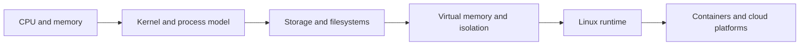

---
title: 'Foundations'
---

# Foundations

Foundations is where the repository stops treating the platform as magic. This section connects machine behavior, operating systems, memory, storage, and Linux runtime ideas to the DevOps, Cloud, and SRE work that comes later.

## What This Section Helps You See

  

    
CORE

    <h3>How systems really behave</h3>
    
CPU cycles, memory, boot flow, processes, storage, and isolation all shape the runtime behavior of higher-level platforms.

  

  

    
WHY

    <h3>Why platform abstractions leak</h3>
    
Containers, Kubernetes, and cloud services are easier to debug once you understand the lower layers they inherit from.

  

  

    
LINK

    <h3>Where the lower layers reappear</h3>
    
You will see these ideas later in node pressure, throttling, disk latency, process failures, and storage tradeoffs.

  

## Foundations Flow

You do not need to memorize every low-level term. The real goal is to build a mental model that helps later cloud and platform topics feel grounded.

## Why It Matters by Role

  

    
DV

    <h3>For DevOps engineers</h3>
    
These pages explain why builds, containers, and deployments behave the way they do underneath the tooling.

  

  

    
CL

    <h3>For cloud engineers</h3>
    
These pages make cloud runtime, VM sizing, disk choices, and performance bottlenecks easier to reason about.

  

  

    
SR

    <h3>For SREs</h3>
    
These pages help explain latency, contention, OOM behavior, and many of the symptoms you see during incidents.

  

## Reading Path

  

    
01

    <h3>From Computers to Cloud</h3>
    
Start with the story page before moving into deeper foundation chapters.

    
<a href="./from-computers-to-cloud.html">Open page</a>

  

  

    
02

    <h3>CPU and Memory Basics</h3>
    
Build the base compute model first so the rest of the section has context.

    
<a href="../CS/Machines%20to%20computers/1.CS_Basics_CPU_Mmeory.html">Open page</a>

  

  

    
03

    <h3>Kernel and Program Flow</h3>
    
Connect machine behavior to operating-system control and safe execution.

    
<a href="../CS/Machines%20to%20computers/6.end_to_end_kernel_cpu_program_flow.html">Open page</a>

  

  

    
04

    <h3>Disk and Virtual Memory</h3>
    
Move into persistence and memory management once the CPU and kernel model is stable.

    
<a href="../CS/Disk/index.html">Open page</a>

  

  How to use this section
  <h3>Build the model, then revisit as needed</h3>
  
The best way to use foundations is to read just enough to understand the model, then come back later when Linux, containers, Kubernetes, or cloud incidents point you here again.

