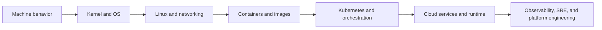

---
title: 'From Computers to Cloud'
---

# From Computers to Cloud

This page is the bridge between computer basics and cloud platform thinking. Read it when the cloud feels too abstract and you want to see how modern platforms are still built on CPUs, memory, storage, kernels, Linux, networking, and runtime tradeoffs.

## What This Page Helps You See

  

    
BASE

    <h3>Cloud is not magic</h3>
    
Managed services still run on real compute, memory, storage, networking, and operating-system behavior.

  

  

    
WHY

    <h3>Foundations explain failures</h3>
    
CPU saturation, storage latency, process crashes, and memory pressure all show up later as delivery and runtime pain.

  

  

    
UP

    <h3>Every higher layer inherits lower limits</h3>
    
Containers, Kubernetes, cloud platforms, and SRE practices all build on the lower layers beneath them.

  

## Machine to Platform Flow

The point of this page is not to replace the deeper chapters. It is to give you a clean mental map so each later topic has a place in the bigger story.

## Comparison: Without Foundations vs With Foundations

  

    Without foundations
    <h3>Tools feel disconnected</h3>
    
Docker, Kubernetes, cloud services, and observability tools feel like separate products you memorize one by one.

  

  

    With foundations
    <h3>Systems start to connect</h3>
    
You can explain why a platform behaves the way it does because you can trace it down to Linux, memory, storage, and networking behavior.

  

## Why It Matters by Role

  

    
DV

    <h3>For DevOps engineers</h3>
    
This page helps connect pipelines, runtime packaging, deployment behavior, and troubleshooting back to the machine and OS model underneath.

  

  

    
CL

    <h3>For cloud engineers</h3>
    
This page helps map managed services and runtime abstractions back to compute, network, storage, and failure-domain realities.

  

  

    
SR

    <h3>For SREs</h3>
    
This page helps connect incidents, latency, saturation, and reliability outcomes to the layers that actually generate them.

  

## Best Next Steps

  

    
01

    <h3>Machines to Computers</h3>
    
Use the hardware and OS notes when you want the deep explanation of CPU, kernel, and multitasking behavior.

    
<a href="../CS/Machines%20to%20computers/index.html">Open page</a>

  

  

    
02

    <h3>Disk Foundations</h3>
    
Follow the persistence path from disks and filesystems to storage behavior in cloud systems.

    
<a href="../CS/Disk/index.html">Open page</a>

  

  

    
03

    <h3>Virtual Memory</h3>
    
Study isolation, paging, and memory pressure before moving into containers and Kubernetes.

    
<a href="../CS/Virtual_Memory/index.html">Open page</a>

  

  

    
04

    <h3>Linux</h3>
    
Continue upward into the runtime layer once the machine model feels clear.

    
<a href="../02-linux/">Open page</a>

  

  How to use this page
  <h3>Use this as a bridge, not a final stop</h3>
  
Read this page to connect the layers. Then go deeper into the foundations chapters or move upward into Linux, containers, orchestration, and cloud depending on what you need next.

