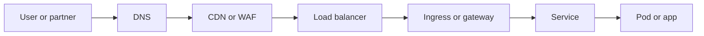

# Networking

Networking explains how traffic actually moves from a user or partner system into your platform. This section is designed to make DNS, TLS, ingress, and edge routing feel operational instead of abstract.

## What This Section Helps You See

  

    
PATH

    <h3>The full request path</h3>
    
Modern traffic often flows through DNS, CDN, WAF, load balancing, ingress, service routing, and finally the workload.

  

  

    
WHY

    <h3>Why traffic problems feel confusing</h3>
    
Many failures that look like app issues are really routing, certificate, exposure, or network-boundary problems.

  

  

    
EDGE

    <h3>Where cloud networking matters</h3>
    
This section helps with ingress design, edge controls, hybrid paths, and secure application entry patterns.

  

## Request Entry Flow

This is the north-south request path you will keep seeing in modern cloud platforms and Kubernetes-based systems.

## Why It Matters by Role

  

    
DV

    <h3>For DevOps engineers</h3>
    
This section helps debug why traffic is not reaching the app and why deployments fail at the edge even when the workload is healthy.

  

  

    
CL

    <h3>For cloud engineers</h3>
    
This section helps compare cloud-native entry services and design cleaner network boundaries and request paths.

  

  

    
SR

    <h3>For SREs</h3>
    
This section helps trace user-facing outages through the edge and network path instead of checking the app layer only.

  

## Reading Path

  

    
01

    <h3>Edge Routing Decision Map</h3>
    
Start here to compare common edge and routing components clearly.

    
<a href="./edge-routing-decision-map.html">Open page</a>

  

  

    
02

    <h3>Runtime and Edge Traffic Path</h3>
    
Follow a full request from user to workload across the edge stack.

    
<a href="../12-cloud/runtime-edge-traffic-path.html">Open page</a>

  

  

    
03

    <h3>Cloud Networking Notes Part 1</h3>
    
Go deeper into practical networking patterns and terminology.

    
<a href="../cloud-networking/Networking.html">Open page</a>

  

  

    
04

    <h3>Cloud Networking Notes Part 2</h3>
    
Continue with more detailed network design and troubleshooting notes.

    
<a href="../cloud-networking/Networking2.html">Open page</a>

  

  How to use this section
  <h3>Study the path before the products</h3>
  
Start with the request path and only then learn the individual services. That order makes cloud networking easier to retain and easier to apply under incident pressure.

