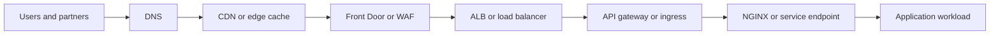

# Edge Routing Decision Map

This page explains the north-south path at a tool-choice level without going too deep yet.

## High-level flow

## What to explain on deeper pages later

- When to use Front Door versus ALB
- When API gateway is required
- Where ingress and NGINX fit in Kubernetes
- TLS, certificates, and header forwarding
- Edge security versus application security responsibilities

## Current references

- [runtime-edge-traffic-path.md](../12-cloud/runtime-edge-traffic-path.md)
- [cloud-networking/Networking.html](../cloud-networking/Networking.html)
- [Server/WebServer/Ngnix.md](../Server/WebServer/Ngnix.md)
