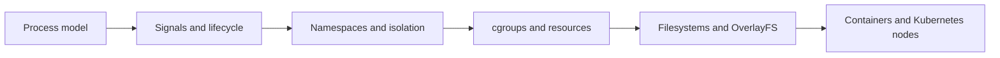

---
title: 'Linux'
---

# Linux

Linux is the runtime foundation behind most containers, nodes, and cloud workloads. This section is tuned for platform and operations work rather than for generic Linux administration alone.

## What This Section Helps You See

  

    
PROC

    <h3>How runtime really behaves</h3>
    
Processes, signals, filesystems, namespaces, and cgroups explain much of what later shows up in containers and Kubernetes.

  

  

    
WHY

    <h3>Why platforms leak Linux behavior</h3>
    
Even managed runtimes still inherit Linux process, file, and resource-control behavior underneath.

  

  

    
NODE

    <h3>Where this shows up in cloud work</h3>
    
This section helps with OOM issues, cgroup throttling, zombie processes, OverlayFS behavior, and workload isolation.

  

## Linux Runtime Flow

This section is the bridge between raw machine internals and container or node-level runtime behavior.

## Why It Matters by Role

  

    
DV

    <h3>For DevOps engineers</h3>
    
This section helps explain why app processes exit, hang, restart, or behave differently between local and production runtime.

  

  

    
CL

    <h3>For cloud engineers</h3>
    
This section helps reason about node-level performance, container isolation, and secure workload behavior in clusters and VMs.

  

  

    
SR

    <h3>For SREs</h3>
    
This section helps diagnose CPU throttling, memory pressure, file-descriptor issues, and kernel-driven failure patterns.

  

## Reading Path

  

    
01

    <h3>Linux OS Introduction</h3>
    
Start with the runtime model before going into containers and cgroups.

    
<a href="../basics/3.0.LinuxOSIntro.html">Open page</a>

  

  

    
02

    <h3>Container Isolation Notes</h3>
    
Connect Linux primitives directly to container behavior.

    
<a href="../basics/3.1.linux_container_isolation_notes.html">Open page</a>

  

  

    
03

    <h3>Processes, Signals, Zombies, and OOM</h3>
    
Study the process lifecycle issues that often surface in production.

    
<a href="../basics/3.2.0.linux_processes_signals_zombies_oom_docker_k8s.html">Open page</a>

  

  

    
04

    <h3>cgroups CPU and Memory Deep Dive</h3>
    
Go deeper into the resource controls that shape container performance.

    
<a href="../basics/3.4.linux_cgroups_cpu_memory_deep_dive.html">Open page</a>

  

  How to use this section
  <h3>Read Linux as a runtime model</h3>
  
Do not treat this section like a command catalog. Focus on process behavior, isolation, and resource control first because those ideas carry directly into containers and cloud operations.

