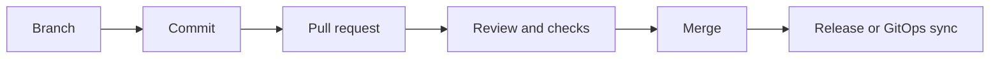

# Git

Git is the collaboration and change-control layer underneath modern DevOps work. This section keeps the focus on safe change, review discipline, and release flow rather than on commands alone.

## What This Section Helps You See

  

    
CHG

    <h3>How teams move change safely</h3>
    
Version control, branching, review, and merge flow create the operating model for safe software and infrastructure change.

  

  

    
WHY

    <h3>Why Git matters beyond developers</h3>
    
Infrastructure code, deployment definitions, and GitOps workflows all inherit the same change-control model.

  

  

    
TRACE

    <h3>Where it shows up operationally</h3>
    
This section helps with auditability, rollback confidence, review quality, and connecting incidents back to changes.

  

## Change Flow

Good Git practice shortens the path between change and safe production impact.

## Why It Matters by Role

  

    
DV

    <h3>For DevOps engineers</h3>
    
This section helps build safer release flow, cleaner review habits, and better collaboration around delivery changes.

  

  

    
CL

    <h3>For cloud engineers</h3>
    
This section helps treat infrastructure and runtime definitions as reviewed, auditable change rather than unmanaged drift.

  

  

    
SR

    <h3>For SREs</h3>
    
This section helps trace behavior changes and incidents back to the exact review and merge events that introduced them.

  

## Reading Path

  

    
01

    <h3>PR Review and Branching</h3>
    
Start with the collaboration pattern most teams use every day.

    
<a href="./pr-review-and-branching.html">Open page</a>

  

  

    
02

    <h3>Git Fundamentals</h3>
    
Review the model underneath the workflow so commands make sense.

    
<a href="../Git/git.html">Open page</a>

  

  

    
03

    <h3>Git Branching Strategy</h3>
    
Compare common branch models and when they help or hurt delivery.

    
<a href="../Git/git-branching-strategy.html">Open page</a>

  

  

    
04

    <h3>Git Visualize</h3>
    
Use a visual mental model to make history, merge, and rollback behavior clearer.

    
<a href="../Git/git-visualize.html">Open page</a>

  

  How to use this section
  <h3>Read Git as a change-safety topic</h3>
  
Keep asking one question: how does this Git habit make change safer, faster, and more reversible? That framing keeps the section aligned with real DevOps outcomes.

