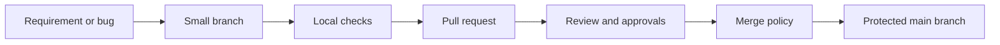

# PR Review and Branching

This page gives a practical high-level view of how work should move before CI/CD starts.

## What good looks like

- Small, reviewable pull requests
- Clear titles, summaries, and rollback notes
- Required reviews and branch protection
- CI checks attached to the PR, not run after accidental merge
- Merge strategy aligned with release traceability

## Reading order

1. [todo/05-version-control-before-git.todo.md](../todo/05-version-control-before-git.todo.html)
2. [Git/git.md](../Git/git.html)
3. [Git/git-branching-strategy.md](../Git/git-branching-strategy.html)
4. [Git/git-visualize.md](../Git/git-visualize.html)
