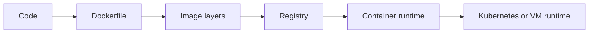

---
title: 'Containers'
---

# Containers

Containers explain how software moved from machine-tied deployment to portable runtime units. This section focuses on packaging, images, registries, isolation, and the operational tradeoffs behind portable runtime behavior.

## What This Section Helps You See

  

    
PKG

    <h3>How software gets packaged</h3>
    
Containers turn code and dependencies into a portable artifact that can move across development, CI, and production.

  

  

    
WHY

    <h3>Why containers changed delivery</h3>
    
The same image can move through build, scan, registry, promotion, and runtime with much less environment drift.

  

  

    
ISOL

    <h3>Where the runtime model matters</h3>
    
This section helps with image design, layer caching, container security, and the Linux isolation model underneath the runtime.

  

## Packaging to Runtime Flow

Containers are easiest to understand when you see both sides at once: the artifact side and the runtime-isolation side.

## Why It Matters by Role

  

    
DV

    <h3>For DevOps engineers</h3>
    
This section helps standardize how software is built, packaged, promoted, and run across environments.

  

  

    
CL

    <h3>For cloud engineers</h3>
    
This section helps connect registries, managed container platforms, and runtime targets to one clear artifact flow.

  

  

    
SR

    <h3>For SREs</h3>
    
This section helps debug image bloat, isolation boundaries, runtime risk, and resource behavior once workloads are live.

  

## Reading Path

  

    
01

    <h3>Docker Story Placeholder</h3>
    
Start with the narrative frame if you want the why before the mechanics.

    
<a href="../todo/04-containers-docker.todo.html">Open page</a>

  

  

    
02

    <h3>Docker</h3>
    
Study the image, container, and workflow model most teams encounter first.

    
<a href="../Basics/3.docker.html">Open page</a>

  

  

    
03

    <h3>Container Isolation Notes</h3>
    
Connect containers back to Linux primitives so the runtime is less mysterious.

    
<a href="../Basics/3.1.linux_container_isolation_notes.html">Open page</a>

  

  

    
04

    <h3>OverlayFS</h3>
    
Understand how layered filesystems affect build speed and runtime behavior.

    
<a href="../Basics/3.2.OverlayFS.html">Open page</a>

  

  How to use this section
  <h3>Read containers as both package and runtime</h3>
  
Do not stop at build and run commands. The real value comes when you connect image design, isolation, filesystems, and security posture to the environments where the workloads actually live.

