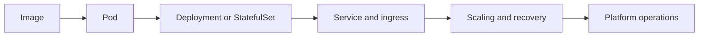

---
title: 'Orchestration'
---

# Orchestration

Orchestration is where container packaging becomes fleet operations. This section focuses on Kubernetes, Helm, service exposure, rollout control, and the control loops that keep runtime platforms stable.

## What This Section Helps You See

  

    
CTRL

    <h3>Desired state in action</h3>
    
Kubernetes is easier to understand when you see it as a control system that keeps reconciling reality toward the declared state.

  

  

    
SHIP

    <h3>Why deployments changed</h3>
    
Once you run many services together, rollout, rollback, scaling, and service exposure need orchestration instead of manual operations.

  

  

    
RUN

    <h3>Where it shows up in cloud work</h3>
    
Managed Kubernetes, platform operations, service networking, and autoscaling all depend on this orchestration model.

  

## Runtime Control Loop

Read orchestration as a runtime control loop. The platform is always trying to keep live state aligned with declared intent.

## Why It Matters by Role

  

    
DV

    <h3>For DevOps engineers</h3>
    
This section helps you move from packaging software to operating safer rollouts, controlled releases, and recoverable runtime behavior.

  

  

    
CL

    <h3>For cloud engineers</h3>
    
This section helps you compare managed orchestration platforms and understand the shared model behind their runtime behavior.

  

  

    
SR

    <h3>For SREs</h3>
    
This section helps you reason about restarts, saturation, rollout failure, service exposure, and workload health during incidents.

  

## Reading Path

  

    
01

    <h3>Kubernetes</h3>
    
Start with the cluster object model and the core orchestration concepts.

    
<a href="../K8s/K8s.html">Open page</a>

  

  

    
02

    <h3>Helm</h3>
    
See how teams package and version Kubernetes resources for reuse.

    
<a href="../K8s/helm.html">Open page</a>

  

  

    
03

    <h3>High Availability</h3>
    
Connect orchestration to resilience, redundancy, and service continuity.

    
<a href="../K8s/highavailabilty.html">Open page</a>

  

  

    
04

    <h3>StatefulSet Simplified</h3>
    
Use a stateful example to see where orchestration becomes more nuanced.

    
<a href="../DB/statefulset-simplified.html">Open page</a>

  

  How to use this section
  <h3>Keep the control-loop model in mind</h3>
  
If Kubernetes feels too large, come back to one question: what desired state is the platform trying to maintain? That question makes controllers, rollouts, scaling, and recovery much easier to follow.

