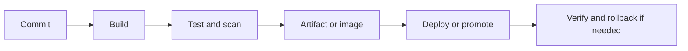

---
title: 'CI CD'
---

# CI CD

CI CD is the delivery engine that turns change into tested, scanned, packaged, promoted, and reversible releases. This section is built around flow, safety, and scale rather than around pipeline YAML alone.

## What This Section Helps You See

  

    
FLOW

    <h3>The full change path</h3>
    
Good pipelines connect commit, build, test, scan, artifact creation, deployment, verification, and rollback as one system.

  

  

    
SAFE

    <h3>Why speed needs control</h3>
    
The best delivery systems do not only move fast. They make change reviewable, measurable, and safer in production.

  

  

    
EDGE

    <h3>Where cloud enters the picture</h3>
    
Registries, OIDC, runtime targets, and promotion strategies all connect CI CD directly to the cloud runtime story.

  

## Change to Production Flow

The main idea is simple: every stage should either increase trust or reduce risk before the change reaches production.

## Why It Matters by Role

  

    
DV

    <h3>For DevOps engineers</h3>
    
This section helps you design pipelines that balance feedback speed, release confidence, and operational safety.

  

  

    
CL

    <h3>For cloud engineers</h3>
    
This section helps connect registries, identities, runtime targets, and environment promotion to the wider architecture.

  

  

    
SR

    <h3>For SREs</h3>
    
This section helps explain how release quality, verification, and rollback paths directly influence reliability.

  

## Reading Path

  

    
01

    <h3>Software Delivery Map</h3>
    
Start with the big-picture delivery flow before going into pipeline details.

    
<a href="./software-delivery-map.html">Open page</a>

  

  

    
02

    <h3>CI Foundations</h3>
    
Review the conceptual pipeline model before deeper enterprise examples.

    
<a href="../basics/6.0.0.CI.html">Open page</a>

  

  

    
03

    <h3>Continuous Delivery and Deployment</h3>
    
Study the promotion path from successful builds to controlled release.

    
<a href="../basics/CI/2.continuous_delivery_deployment_wiki.html">Open page</a>

  

  

    
04

    <h3>Enterprise GitHub Actions Project</h3>
    
See how the model works in a more realistic enterprise-scale example.

    
<a href="../basics/CD/Github/Enterprise_CICD_GitHubActions_OIDC_Kubernetes_Project.html">Open page</a>

  

  How to use this section
  <h3>Read pipelines as systems, not only YAML</h3>
  
Focus on trust boundaries, promotion points, rollback paths, and runtime verification. Those ideas matter more than the exact CI tool syntax.

