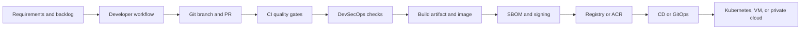

# Software Delivery Map

This is the high-level flow for how modern teams move from code to production.

## Stage Summary

### Requirements and backlog
- User stories, non-functional requirements, and release goals.

### Developer workflow
- Local development, unit tests, linting, and environment parity.

### Git branch and PR
- Branch naming, pull request quality, review comments, approvals, and merge policy.

### CI quality gates
- Build, unit tests, integration tests, static checks, and fast feedback.

### DevSecOps checks
- SAST, dependency scanning, secret scanning, IaC scanning, and container scanning.

### Build artifact and image
- Reproducible package build, container image creation, and metadata capture.

### SBOM and signing
- Supply chain visibility, provenance, trust, and artifact integrity.

### Registry or ACR
- Versioned image storage, retention policy, access control, and promotion flow.

### CD or GitOps
- Promotion strategy, deployment orchestration, approvals, and rollback.

### Runtime target
- Kubernetes, VMs, or private cloud depending on architecture and operating model.

## Current source material

- [basics/CI/1.ci_foundations_remember.md](../basics/CI/1.ci_foundations_remember.md)
- [basics/CD/Github/CI_CD_Architecture_SAP_Scale.md](../basics/CD/Github/CI_CD_Architecture_SAP_Scale.md)
- [basics/CD/Github/ci_cd_security_sap_scale_wiki.md](../basics/CD/Github/ci_cd_security_sap_scale_wiki.md)
- [.github/workflows](../.github/workflows/)

## What to deepen next

1. A dedicated page for Git and PR best practices.
2. A dedicated DevSecOps page for SBOM, signing, and policy enforcement.
3. A delivery decision tree for GitHub Actions, Azure DevOps, and GitOps.
