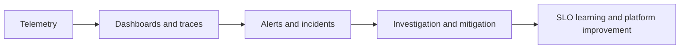

---
title: 'Observability'
---

# Observability

Observability is the part of the platform that helps teams see, understand, and improve production behavior. This section keeps the focus on telemetry, alerting, service health, and the reliability loop that follows incidents.

## What This Section Helps You See

  

    
SEE

    <h3>How systems speak back</h3>
    
Metrics, logs, traces, and events are the signals that tell you what the runtime is doing and why users feel impact.

  

  

    
LEARN

    <h3>Why observability is more than tooling</h3>
    
The real value is not the dashboard itself. It is the faster path from symptom to explanation to better engineering decisions.

  

  

    
SLO

    <h3>Where it matters operationally</h3>
    
This section helps with alerts, incident response, runtime learning, SLO thinking, and platform feedback loops.

  

## Reliability Feedback Loop

Observability is not only about data collection. It is the feedback loop that turns production behavior into better system design and better operational habits.

## Why It Matters by Role

  

    
DV

    <h3>For DevOps engineers</h3>
    
This section helps connect deployment quality to measurable runtime signals after change reaches production.

  

  

    
CL

    <h3>For cloud engineers</h3>
    
This section helps instrument distributed systems and managed services without losing the ability to debug real issues.

  

  

    
SR

    <h3>For SREs</h3>
    
This section helps build useful alerts, reduce noise, and turn incidents into reliability learning instead of repeated firefighting.

  

## Reading Path

  

    
01

    <h3>Observability and SRE Loop</h3>
    
Start with the end-to-end loop that connects telemetry, incidents, and learning.

    
<a href="./observability-and-sre-loop.html">Open page</a>

  

  

    
02

    <h3>Platform Engineering</h3>
    
See how observability becomes a platform capability instead of an afterthought.

    
<a href="../13-platform-engineering/internal-developer-platform.html">Open page</a>

  

  

    
03

    <h3>Role Journey Story</h3>
    
Connect observability maturity to DevOps, platform, and SRE growth.

    
<a href="../15-projects/devops-platform-sre-learning-journey.html">Open page</a>

  

  How to use this section
  <h3>This section is a growth area on purpose</h3>
  
The repo is still expanding here, but the framing is now in place: start with the SRE loop, then use platform and project pages to keep the topic tied to real production work instead of tool lists.

