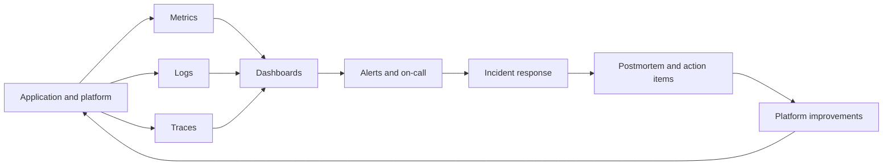

# Observability and SRE Loop

Operations do not end at deployment. This is the feedback loop that keeps systems reliable.

## What this section should teach

- The difference between monitoring and observability.
- Golden signals, service health, saturation, and latency patterns.
- Alert design, noise reduction, escalation, and incident hygiene.
- SLIs, SLOs, error budgets, and production feedback into engineering work.

## Gaps to fill first

- Prometheus and Grafana overview
- Logs and tracing patterns
- SLO examples for APIs and platform services
- Incident review and runbook structure
