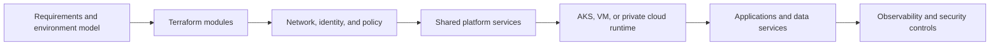

# Infrastructure Provisioning Flow

This page shows how IaC connects planning, cloud resources, policy, and runtime platforms.

## Key ideas

- Provisioning is more than creating resources. It also defines guardrails.
- Network, identity, registry, and logging often need to exist before application deployment.
- The platform team should make safe defaults easy and unsafe patterns hard.

## Current source material

- [terraform/main.tf](../terraform/main.tf)
- [terraform/modules/acr](../terraform/modules/acr/)
- [terraform/modules/aks](../terraform/modules/aks/)
- [terraform/modules/vnet](../terraform/modules/vnet/)

## What to deepen next

1. Environment strategy: dev, test, stage, prod.
2. Terraform state, module boundaries, and naming standards.
3. Policy as code and access federation.
