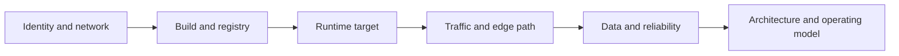

# Cloud

Cloud is where infrastructure, networking, runtime, identity, managed services, and platform tradeoffs meet. This section is organized around architecture decisions and operating paths instead of around provider catalogs alone.

## What This Section Helps You See

  

    
ARCH

    <h3>The operating model behind the cloud</h3>
    
Cloud is not only compute on demand. It is a system of identity, networking, runtime targets, storage, and managed-service decisions.

  

  

    
FLOW

    <h3>Why delivery meets architecture here</h3>
    
Registry promotion, runtime targets, traffic flow, and environment design all connect delivery directly to architecture.

  

  

    
RISK

    <h3>Where tradeoffs become real</h3>
    
This section helps with managed-service choices, modernization, edge paths, failure domains, and cost-versus-control decisions.

  

## Cloud Platform Flow

The cloud is easier to reason about when you see it as one operating model rather than as a list of services.

## Comparison: Fast Cloud Thinking vs Good Cloud Thinking

  

    Fast but shallow
    <h3>Pick a service and move on</h3>
    
This works for quick demos, but it usually hides identity, edge, runtime, reliability, and operating-cost consequences.

  

  

    Better platform thinking
    <h3>Design the full path</h3>
    
Good cloud decisions consider traffic entry, promotion, runtime, observability, security, and long-term operational ownership together.

  

## Why It Matters by Role

  

    
DV

    <h3>For DevOps engineers</h3>
    
This section helps connect delivery systems to registries, runtime targets, edge services, and environment promotion patterns.

  

  

    
CL

    <h3>For cloud engineers</h3>
    
This section helps compare abstractions and make better architecture decisions with clearer awareness of tradeoffs.

  

  

    
SR

    <h3>For SREs</h3>
    
This section helps locate where latency, failure domains, scaling limits, and cost-pressure enter the design.

  

## Reading Path

  

    
01

    <h3>Cloud Architecture and Well Architected</h3>
    
Start with the decision frame before looking at individual runtime paths.

    
<a href="./cloud-architecture-and-well-architected.html">Open page</a>

  

  

    
02

    <h3>Runtime and Edge Traffic Path</h3>
    
Follow user traffic from the edge to the workload to make the runtime model tangible.

    
<a href="./runtime-edge-traffic-path.html">Open page</a>

  

  

    
03

    <h3>ACR and Runtime Promotion</h3>
    
Connect delivery, registries, and promotion strategy to cloud runtime choices.

    
<a href="./acr-and-runtime-promotion.html">Open page</a>

  

  

    
04

    <h3>VM to AKS Modernization Story</h3>
    
See the architecture ideas appear in a realistic modernization narrative.

    
<a href="../15-projects/vm-to-aks-modernization-story.html">Open page</a>

  

  How to use this section
  <h3>Read cloud through tradeoffs</h3>
  
Whenever you open a cloud page here, ask what you gain, what you lose, and what you now have to operate. That habit is more valuable than memorizing service names.

