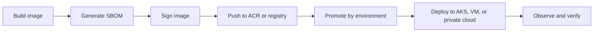

# ACR and Runtime Promotion

This page bridges the gap between pipeline output and the deployed runtime.

## What this page should cover later

- Tagging and version strategy
- Promotion versus rebuild decisions
- ACR retention and access control
- Pull secrets, workload identity, and runtime auth
- Rollback and release verification

## Current references

- [software-delivery-map.md](../09-ci-cd/software-delivery-map.html)
- [terraform/modules/acr](../terraform/modules/acr/)
- [runtime-edge-traffic-path.md](./runtime-edge-traffic-path.html)
