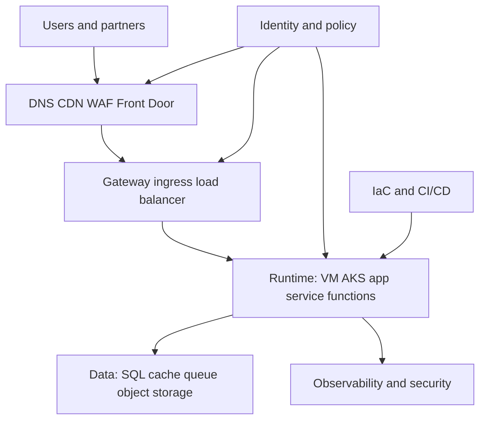

# Cloud Architecture and Well-Architected Review

This page explains what cloud architecture means in practical DevOps and platform terms.

## What cloud architecture actually is

Cloud architecture is the design of how these layers work together:
- identity
- network
- edge entry
- compute runtime
- data services
- security controls
- observability
- delivery and IaC control plane

A cloud design is good only when it supports business needs, team maturity, and production reliability.

## The core architecture layers

## Common patterns

### 1. VM-centered architecture

Best when:
- applications are legacy or tightly coupled
- the team is early in cloud adoption
- there are few workloads

Watch out for:
- configuration drift
- patching overhead
- slower scaling
- hard-to-standardize deployments

### 2. AKS or Kubernetes-centered architecture

Best when:
- multiple services need a common runtime
- standard deployment patterns matter
- teams need consistent scaling and rollout behavior

Watch out for:
- complexity arriving faster than team maturity
- poor stateful workload choices
- weak observability and network design

### 3. Managed-service-first architecture

Best when:
- the team wants to reduce undifferentiated operational work
- database, queue, cache, and identity services can be consumed as products

Watch out for:
- hidden cost growth
- coupling to provider features
- weak ownership boundaries

### 4. Hybrid or private-cloud architecture

Best when:
- regulation or legacy integration requires partial on-prem presence
- network paths and data residency matter

Watch out for:
- identity fragmentation
- operational inconsistency
- complex routing and troubleshooting

## VM versus AKS versus managed services

### Keep on VMs when
- the app is simple and stable
- the team is still building Linux and cloud basics
- the operational cost of AKS would exceed the benefit

### Move app runtime to AKS when
- many services need the same deployment platform
- release speed, autoscaling, and standardization matter
- the team can support networking, observability, secrets, and cluster operations

### Prefer managed data services when
- the workload is business critical and stateful
- backups, HA, patching, and durability are expensive to self-manage
- platform focus is more valuable than database babysitting

## Well-architected review checklist

### Operational excellence
- Are deployments automated and reviewable?
- Can on-call engineers understand and recover the system?
- Are runbooks, dashboards, and ownership clear?

### Security
- Is identity federated and least privilege enforced?
- Are secrets, images, and artifacts controlled?
- Is the ingress path protected with the right edge controls?

### Reliability
- Can the system survive dependency failure?
- Is there a clear HA and DR strategy?
- Are health checks, retries, timeouts, and autoscaling realistic?

### Performance efficiency
- Are the chosen compute and storage types correct?
- Are caches, queues, and scaling policies used properly?
- Are noisy neighbors and shared bottlenecks understood?

### Cost optimization
- Are we paying for the right architecture stage?
- Would managed services reduce hidden operator cost?
- Are oversized VMs or clusters hiding poor design?

### Sustainability
- Are we wasting compute through bad defaults?
- Are repeated manual fixes consuming engineering energy?
- Can the same outcome be achieved with fewer moving parts?

## Recommended reading order in this repo

1. [runtime-edge-traffic-path.md](./runtime-edge-traffic-path.html)
2. [acr-and-runtime-promotion.md](./acr-and-runtime-promotion.html)
3. [provisioning-flow.md](../11-infra-as-code/provisioning-flow.html)
4. [vm-to-aks-modernization-story.md](../15-projects/vm-to-aks-modernization-story.html)
5. [onprem/MigrationMM.md](../onprem/MigrationMM.html)
6. [cloud-networking/Networking.html](../cloud-networking/Networking.html)
7. [DB/comparisiontable.md](../DB/comparisiontable.html)
