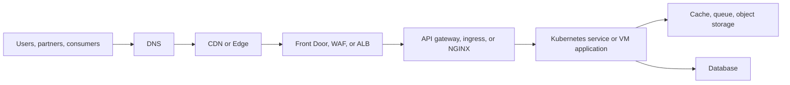

# Runtime and Edge Traffic Path

This page is the high-level picture for how users reach workloads after deployment.

## What belongs in this story

- User-side security and edge controls
- TLS termination and certificate strategy
- API gateway versus ingress versus load balancer roles
- Kubernetes versus VM runtime differences
- Internal service communication, storage, and resilience points

## Current source material

- [cloud-networking/Networking.html](../cloud-networking/Networking.html)
- [cloud-networking/Networking2.html](../cloud-networking/Networking2.html)
- [Server/WebServer/Ngnix.md](../Server/WebServer/Ngnix.md)
- [onprem/MigrationMM.md](../onprem/MigrationMM.md)

## What to deepen next

1. Edge decision tree for Front Door, ALB, API gateway, and NGINX.
2. Separate diagrams for Kubernetes and VM deployment patterns.
3. A private cloud runtime story with shared networking and security controls.
