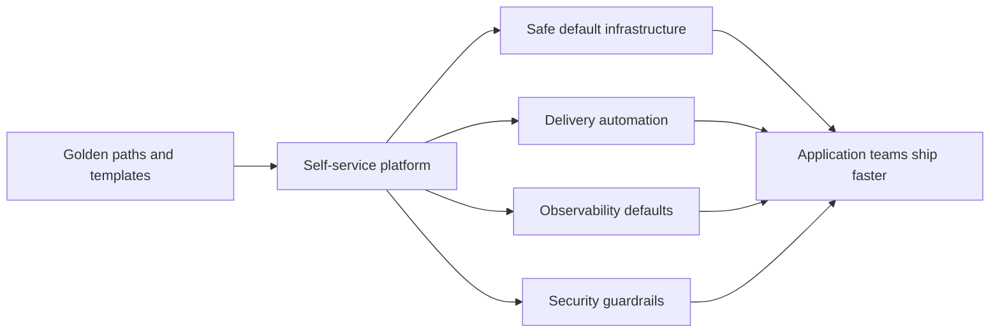

---
title: 'Internal Developer Platform'
---

# Internal Developer Platform

Platform engineering is how we turn repeated operational knowledge into a product for internal teams.

## Core ideas

- Platform engineering is not just tooling. It is product thinking for internal developer experience.
- Golden paths reduce cognitive load for common use cases.
- Guardrails should be built into the platform, not added manually each time.
- Observability, security, and delivery should feel built-in, not optional.

## Current source material

- [basics/2.Platformengineering.md](../Basics/2.Platformengineering.html)
- [software delivery map](../09-ci-cd/software-delivery-map.html)
- [observability and SRE loop](../10-observability/observability-and-sre-loop.html)

## What to deepen next

1. Platform personas: application team, platform team, security team, SRE.
2. Backstage or internal portal style workflows.
3. Paved-road templates for services, CI/CD, observability, and security.

