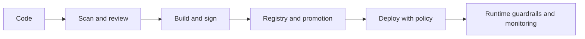

---
title: 'Security'
---

# Security

Security in this repository is focused on the delivery path and runtime path together. The goal is to make secure defaults, supply chain trust, and runtime guardrails understandable from a platform point of view.

## What This Section Helps You See

  

    
TRUST

    <h3>Security as a path</h3>
    
Good security is built across code, build, registry, deployment, runtime, and monitoring rather than added at the end.

  

  

    
SHIFT

    <h3>Why shift-left is not enough alone</h3>
    
Scanning earlier helps, but runtime controls, identity boundaries, and supply-chain trust still matter after deployment.

  

  

    
GUARD

    <h3>Where platform defaults matter</h3>
    
This section helps with secret handling, policy, container risk, software trust, and secure release paths.

  

## Trust Path

The strongest security posture is built when each stage of the path increases trust or limits blast radius.

## Why It Matters by Role

  

    
DV

    <h3>For DevOps engineers</h3>
    
This section helps place policy and trust controls directly into delivery flow without losing too much speed.

  

  

    
CL

    <h3>For cloud engineers</h3>
    
This section helps connect identity, secrets, policy, and service usage to safer platform architecture.

  

  

    
SR

    <h3>For SREs</h3>
    
This section helps think about blast radius, runtime abuse, secure recovery, and production guardrails under pressure.

  

## Reading Path

  

    
01

    <h3>DevSecOps Supply Chain</h3>
    
Start with the delivery-path view of software trust and integrity.

    
<a href="./devsecops-supply-chain.html">Open page</a>

  

  

    
02

    <h3>Privileged Containers Threat Model</h3>
    
Connect container runtime behavior to real security boundaries.

    
<a href="../Basics/3.3.privileged_containers_threat_model.html">Open page</a>

  

  

    
03

    <h3>CI CD Security at Scale</h3>
    
See how enterprise delivery systems become security control points.

    
<a href="../Basics/CD/Github/ci_cd_security_sap_scale_wiki.html">Open page</a>

  

  

    
04

    <h3>Software Delivery Map</h3>
    
Revisit the delivery flow through a security and trust lens.

    
<a href="../09-ci-cd/software-delivery-map.html">Open page</a>

  

  How to use this section
  <h3>Treat security as an operating model</h3>
  
The most useful reading habit here is to ask how trust is maintained from commit to runtime. That keeps security grounded in platform behavior instead of turning it into a disconnected checklist.

