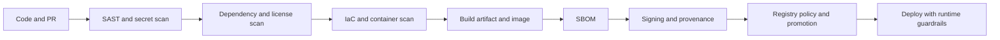

# DevSecOps Supply Chain

This page keeps the delivery security story at a high level for now, while pointing to the places that need more detail later.

## Key controls to explain later

- SAST and secret scanning
- Dependency and container vulnerability scanning
- IaC scanning and policy checks
- SBOM generation and provenance
- Image signing, verification, and registry trust rules
- Runtime admission, policy, and least privilege

## Source material to merge

- [basics/3.3.privileged_containers_threat_model.md](../basics/3.3.privileged_containers_threat_model.html)
- [basics/CD/Github/ci_cd_security_sap_scale_wiki.md](../basics/CD/Github/ci_cd_security_sap_scale_wiki.html)
- [software-delivery-map.md](../09-ci-cd/software-delivery-map.html)
