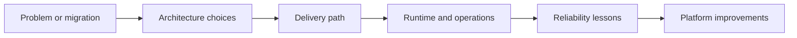

---
title: 'Projects'
---

# Projects

Projects is where the repository connects multiple layers at once. These pages turn theory from foundations, delivery, runtime, cloud, and SRE into realistic stories that feel closer to actual work.

## What This Section Helps You See

  

    
CASE

    <h3>Systems in context</h3>
    
Project stories show how architecture, delivery, runtime, security, and observability interact under real constraints.

  

  

    
FLOW

    <h3>Why story beats memorization</h3>
    
It is easier to remember tradeoffs when they appear in a migration, rollout, or platform scenario instead of as isolated notes.

  

  

    
REAL

    <h3>Where interview answers get stronger</h3>
    
End-to-end stories make it easier to explain not just the tools you know, but the decisions you would make and why.

  

## End-to-End Story Flow

Projects are where the lower layers and higher-level platform decisions finally meet in one operational story.

## Why It Matters by Role

  

    
DV

    <h3>For DevOps engineers</h3>
    
This section helps show how delivery choices influence migration speed, release safety, and runtime ownership.

  

  

    
CL

    <h3>For cloud engineers</h3>
    
This section helps connect architecture targets, modernization decisions, and managed-platform tradeoffs to real scenarios.

  

  

    
SR

    <h3>For SREs</h3>
    
This section helps explain how design changes affect observability, reliability risk, and service behavior after go-live.

  

## Reading Path

  

    
01

    <h3>VM to AKS Modernization Story</h3>
    
Start with the core modernization story that ties infrastructure, delivery, cloud runtime, and platform operations together.

    
<a href="./vm-to-aks-modernization-story.html">Open page</a>

  

  

    
02

    <h3>DevOps to Platform to SRE Journey</h3>
    
Use this page to connect the repository to role growth and operational maturity.

    
<a href="./devops-platform-sre-learning-journey.html">Open page</a>

  

  

    
03

    <h3>On-Prem Migration Map</h3>
    
Look at the transformation sequence when you want a broader migration view.

    
<a href="../onprem/MigrationMM.html">Open page</a>

  

  

    
04

    <h3>Monolith to Microservices Backlog</h3>
    
Use one of the draft story pages when you want to see which project-style chapters can be expanded next.

    
<a href="../todo/03-monolith-to-microservices.todo.html">Open page</a>

  

  How to use this section
  <h3>Use projects to connect layers</h3>
  
If a lower-level concept feels abstract, jump into a project story and watch where it appears in a real architecture or migration decision. That back-and-forth is one of the fastest ways to build intuition.

