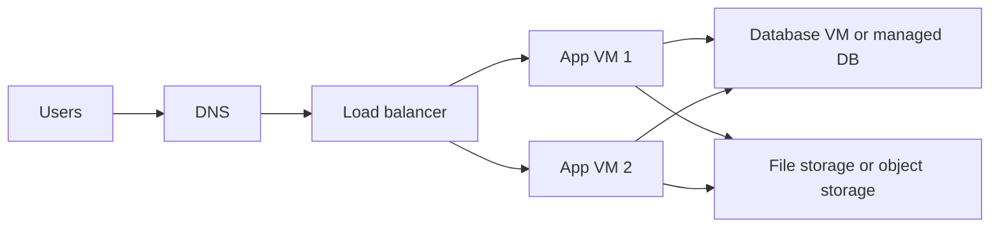
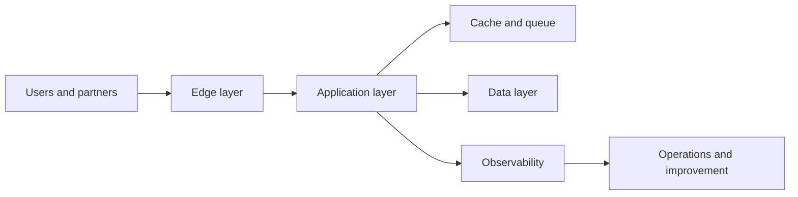
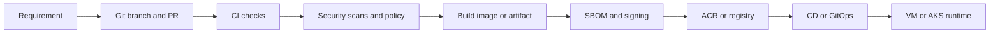
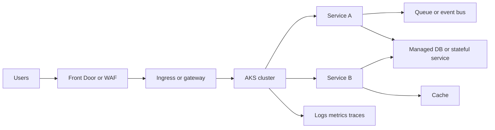

# Real Story: From VMs to AKS and Platform Operations

This is the real story many teams live through.

They do not begin with Kubernetes.
They begin with a business need, a small application, a few Linux VMs, and manual operations. As traffic, team size, security needs, and release pressure increase, the operating model has to evolve. That is where DevOps, Cloud, Platform Engineering, and SRE become necessary.

This page connects the full journey:
- VM era
- system design thinking
- cloud architecture
- CI/CD and DevSecOps
- containers and AKS/Kubernetes
- platform engineering
- observability and SRE
- well-architected review

## Phase 0: Business need and system design start everything

Before cloud, CI/CD, or AKS, there is always a product need.

Example:
- an internal business app or customer portal must go live quickly
- users need login, transactions, reporting, and notifications
- the business expects uptime, security, and reasonable performance

This is where system design begins.

System design is not only for architects. It is required for DevOps engineers too, because deployment and operations depend on design decisions such as:
- monolith or microservices
- VM or Kubernetes runtime
- managed database or self-hosted database
- sync APIs or queues
- public or private access
- single region or disaster recovery setup

## Phase 1: The VM era

Most teams start with a simple setup because it is easy to understand and fast to ship.

### Why VMs are chosen first

- familiar operating model
- easy lift-and-shift from on-prem
- simple for monoliths and legacy applications
- useful when teams are still learning cloud basics

### What the DevOps engineer learns here

- Linux administration
- networking basics
- VM sizing, disks, patching, backups
- NGINX or web server configuration
- DNS, TLS, firewall, load balancing
- shell automation and simple CI/CD

### What starts to break

- every VM becomes different over time
- scaling needs more manual work
- deployments are slow and risky
- rollback is inconsistent
- secrets and config drift across servers
- troubleshooting depends on hero engineers
- business expectations grow faster than operations maturity

This is the point where better system design and cloud architecture become necessary.

## Phase 2: System design becomes unavoidable

When the service grows, the team must stop asking only "how do we deploy this" and start asking "how should this system behave under load, failure, and change?"

### Core design questions

- Where does user traffic enter?
- Which parts must scale independently?
- Which data should stay on VMs, and which should move to managed services?
- Which failures are acceptable, and which are not?
- What are the non-functional requirements for latency, uptime, security, recovery time, and recovery point?

### System design topics DevOps and platform teams must understand

- availability and redundancy
- horizontal versus vertical scaling
- stateful versus stateless services
- caching, queues, backpressure, retries, timeouts
- failure domains and blast radius
- secure network boundaries
- deployment patterns and rollback strategy

If this design is weak, even strong CI/CD and cloud tooling will only automate bad decisions faster.

## Phase 3: Cloud architecture starts replacing manual infrastructure

Cloud architecture is the structure of how identity, network, compute, storage, data, security, and operations fit together.

### Typical cloud architecture layers

1. Identity and access
2. Network and segmentation
3. Edge and traffic entry
4. Compute runtime
5. Data platform
6. Observability and security controls
7. Delivery and IaC control plane

### Common architecture patterns

#### VM-first cloud architecture
- best for simple apps, lift-and-shift, legacy systems
- more OS ownership and patching burden
- good stepping stone but not always the final model

#### Managed-first cloud architecture
- best when managed database, storage, messaging, and identity services can reduce operational load
- trades low-level control for speed and safety

#### Kubernetes or AKS-centric platform architecture
- best when many services need a common runtime
- improves standardization, portability, scaling, and deployment consistency
- requires stronger platform maturity

#### Hybrid or private cloud architecture
- needed when regulation, latency, cost, or legacy integration blocks full public cloud adoption
- increases complexity in network, identity, and operations

## Phase 4: CI/CD and DevSecOps become the delivery backbone

As teams grow, delivery needs to be repeatable and safe.

### What this phase adds

- pull requests and review discipline
- automated tests
- SAST, secret scanning, dependency scanning, IaC scanning
- artifact management
- SBOM and signing
- controlled promotion between environments

### What changes for the DevOps engineer

The role moves from "server operator" toward "delivery engineer plus systems engineer".

## Phase 5: Containers and AKS or Kubernetes enter the picture

Teams move to containers and Kubernetes when they need a standard runtime for many applications, faster deployment patterns, consistent scaling, and safer platform controls.

### Good reasons to move from VMs to AKS

- many applications need the same deployment model
- teams want immutable packaging
- scaling and rollout behavior must be standardized
- platform teams want policy and templates instead of one-off scripts
- release frequency is increasing

### Bad reasons to move too early

- the team still struggles with Linux, networking, and debugging basics
- workloads are few and stable on VMs
- stateful services are not yet well understood
- observability and incident response are weak

### What stays important after moving to AKS

- network design still matters
- storage design matters even more for stateful workloads
- identity and secrets remain critical
- managed services are often better than running everything in cluster
- edge, ingress, gateway, DNS, TLS, and observability still exist outside the cluster too

### What the team must decide carefully

- ingress versus API gateway
- NGINX versus managed ingress options
- managed database versus Kubernetes StatefulSet
- image registry and promotion model
- Helm, Kustomize, or GitOps workflow
- node pools, VM sizes, autoscaling, and cost controls

## Phase 6: Platform engineering appears when scale creates repetition

Once many teams are deploying to AKS or cloud runtimes, repeated manual work becomes the main problem.

Platform engineering solves that by turning best practices into reusable products.

### What the platform team provides

- Terraform modules for network, AKS, ACR, logging, and shared services
- standard CI/CD templates
- approved deployment patterns
- observability defaults
- security guardrails and policy
- golden paths for common service types

### This is the change in mindset

Before platform engineering:
- every team asks the DevOps team for help

After platform engineering:
- the platform team creates paved roads so teams can self-serve safely

## Phase 7: SRE becomes necessary when production risk is the real problem

SRE is not just monitoring tools. It is the engineering practice of making reliability measurable and operational work sustainable.

### What SRE adds

- SLIs and SLOs
- error budgets
- incident response and postmortems
- capacity planning
- release risk management
- toil reduction
- resilience testing

### Why SRE matters after AKS adoption

Kubernetes makes deployment easier, but it does not automatically make systems reliable.

You can still fail because of:
- poor alerts
- wrong autoscaling settings
- weak dependency handling
- noisy retries
- storage bottlenecks
- overload on downstream services
- unclear ownership during incidents

## Phase 8: Well-architected thinking keeps the platform honest

A well-architected review asks whether the design is strong across the pillars that matter in real production systems.

### Practical pillars

- Operational excellence: can the team deploy, observe, recover, and improve safely?
- Security: are identity, secrets, network boundaries, and software supply chain protected?
- Reliability: can the system tolerate failure and recover predictably?
- Performance efficiency: does the design scale without wasting resources?
- Cost optimization: are we paying for the right level of resilience and capacity?
- Sustainability: are we avoiding waste in compute, storage, and repeated rework?

### Example review questions

- Should this workload remain on VMs or move to AKS?
- Should this database be managed or self-hosted?
- Are alerts tied to user impact or only to infrastructure noise?
- Is the ingress path too complex for the current team maturity?
- Do we have safe rollback and disaster recovery paths?

## Phase 9: Basic to advanced path for roles

### DevOps engineer path

Start with:
- Linux
- networking
- Git and CI/CD
- scripting
- cloud basics
- Docker and Kubernetes basics

Then deepen into:
- IaC
- registry and supply chain security
- deployment strategies
- cloud networking and identity
- troubleshooting and observability

### Cloud or platform engineer path

Build on DevOps basics, then deepen into:
- landing zones and multi-environment design
- AKS platform operations
- reusable Terraform modules
- workload identity and secrets
- managed service selection
- golden paths, templates, policy, and governance

### SRE path

Build on platform and runtime knowledge, then deepen into:
- SLI and SLO design
- incident management
- performance and capacity
- reliability patterns
- failure injection and recovery drills
- reducing operational toil through engineering

## What this repo already contains for the rewrite

This story is based on material already present in the repository, including:
- [basics/1.AgileScrumDevops.md](../basics/1.AgileScrumDevops.html)
- [basics/2.Platformengineering.md](../basics/2.Platformengineering.html)
- [basics/CD/Github/CI_CD_Architecture_SAP_Scale.md](../basics/CD/Github/CI_CD_Architecture_SAP_Scale.html)
- [basics/CD/Github/large_scale_ci_cd_enablement_on_prem_to_cloud_migration_sap_interview_prep.md](../basics/CD/Github/large_scale_ci_cd_enablement_on_prem_to_cloud_migration_sap_interview_prep.html)
- [K8s/K8s.md](../K8s/K8s.html)
- [onprem/MigrationMM.md](../onprem/MigrationMM.html)
- [cloud-networking/Networking.html](../cloud-networking/Networking.html)
- [DB/comparisiontable.md](../DB/comparisiontable.html)
- [basics/4.3postgre_sql_on_kubernetes_vs_azure_managed_postgres_platform_guide.md](../basics/4.3postgre_sql_on_kubernetes_vs_azure_managed_postgres_platform_guide.html)

## Recommended next pages

1. [Cloud architecture and well-architected review](../12-cloud/cloud-architecture-and-well-architected.html)
2. [DevOps to Platform to SRE learning journey](./devops-platform-sre-learning-journey.html)
3. [Software delivery map](../09-ci-cd/software-delivery-map.html)
4. [Internal developer platform](../13-platform-engineering/internal-developer-platform.html)
