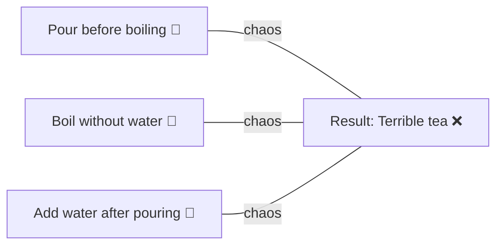
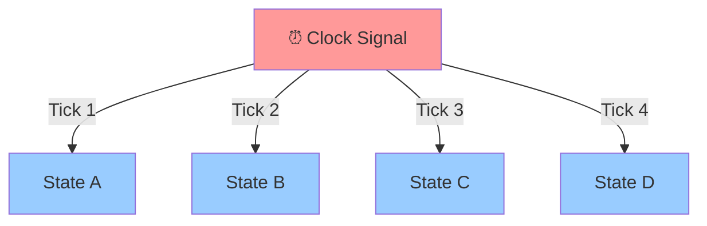
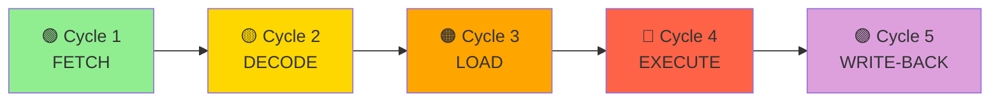
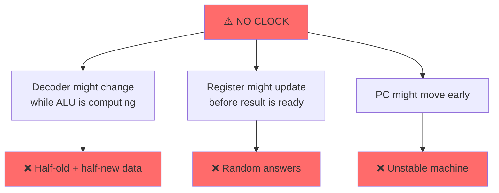
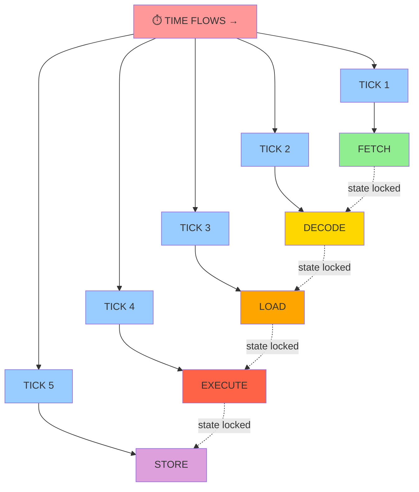
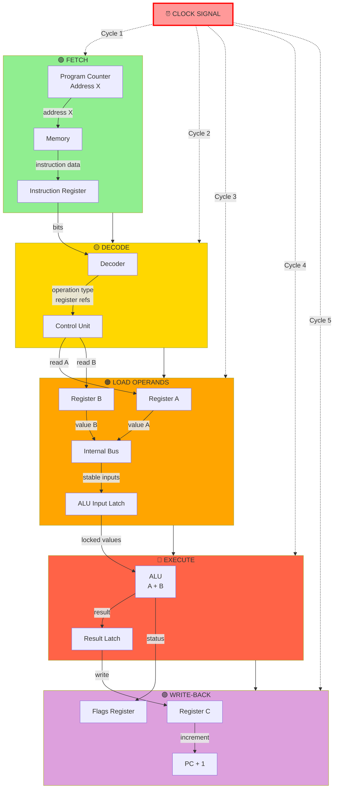

# CPU Cycles: The Foundation of Computation

## 1. The Core Problem CPUs Must Solve

### The Challenge

The fundamental problem is this:

> **Many things must happen, but NOT at the same time.** They must happen in the correct order, or the result is wrong.

```
If they happen together     → Chaos ❌
If they happen in order     → Correct result ✅
```

That's it. Everything else exists to solve this problem.

---

## 2. Layman Example: Making Tea ☕

### The Correct Sequence


### What Happens Without Order



### Key Insight

Humans implicitly follow steps. **Machines cannot assume order unless it is explicitly enforced.**

---

## 3. Why Machines Need Explicit Control

### The Problem with Electricity

Electricity does not "wait". When you connect circuits:

- **Signals flow immediately**
- **Multiple paths activate together**
- **Faster paths win, slower paths lag**

If you say "Load instruction and execute":
- Electricity tries to do both **at once**
- This breaks logic
- Result: Unpredictable behavior 🔥

---

## 4. The CPU's Solution: Forced Steps

CPU enforces a simple rule:

> **"Only ONE step is allowed to change at a time."**

That enforcement mechanism is:

### 👉 **The Clock**



---

## 5. One Real CPU Instruction (Simple)

### The Instruction

```c
C = A + B
```

We'll follow this **exactly** as the CPU does it.

---

## 6. CPU Components & Roles

| Component | Responsibility |
|-----------|-----------------|
| **Program Counter (PC)** | Keeps track of where the next instruction is |
| **Instruction Fetch Unit** | Brings instruction from memory |
| **Decoder** | Understands what the instruction means |
| **Registers** | Hold values of A, B, C |
| **ALU** | Does the addition |
| **Clock** | Controls WHEN each step is allowed |

> **No step happens without clock permission.**

---

## 7. Step-by-Step: One Instruction Across Time

### CPU Execution Pipeline



---

### 🟢 **Cycle 1: Fetch**

**What Happens:**
- PC says: "Next instruction is at address X"
- Memory places instruction on CPU wires
- Instruction is captured into CPU

**Layman's View:** "Read the recipe line"

**Constraint:** Nothing else is allowed to change.

---

### 🟡 **Cycle 2: Decode**

**What Happens:**
- Decoder looks at instruction bits
- Understands: "This is ADD"
- Decides which registers are needed

**Layman's View:** "Understand what the recipe says"

**Constraint:** ALU does nothing yet.

---

### 🟠 **Cycle 3: Load Operands**

**What Happens:**
- Register A value is placed on internal bus
- Register B value is placed on internal bus
- ALU inputs become stable

**Layman's View:** "Take ingredients out"

**Constraint:** No math yet.

---

### 🔴 **Cycle 4: Execute**

**What Happens:**
- ALU gates switch
- Electrical addition occurs
- Result appears at ALU output

**Layman's View:** "Mix ingredients"

**Constraint:** Result is NOT stored yet.

---

### 🟣 **Cycle 5: Write-Back**

**What Happens:**
- Result is written into register C
- Flags updated
- PC increments to next instruction

**Layman's View:** "Put tea into cup"

**Status:** ✅ Instruction complete.

---

## 8. Why This CANNOT Happen Without Clocks

### The Chaos Without Sequencing



### The Clock's Solution

```
"Freeze → Update → Freeze → Update → Freeze → Update"
```

The clock prevents chaos by ensuring atomic state transitions.

---

## 9. Why Cycles Are Counted, Not Seconds

### Time Measurement

| Unit | Who Uses It | Why |
|------|------------|-----|
| **Seconds** | Humans | Easy to understand |
| **Cycles** | CPU | Native to CPU operation |

**The Math:**

$$\text{Time (seconds)} = \frac{\text{Cycles}}{\text{Clock Speed (Hz)}}$$

**Key Point:** Cycles are the **native unit**. Seconds are just how many ticks fit in human time.

---

## 10. The Deepest Truth (Interview Gold) 🏆

> **A CPU does not execute instructions continuously.**
> 
> **It executes them as a sequence of clock-controlled state changes.**

This is why:
- ✅ Cycles exist
- ✅ Clocks exist  
- ✅ Performance tuning exists

---

## 11. Visual: Clock-Driven Execution



**Rule:** No tick → No movement. Period.

---

## 12. Complete CPU Cycle Diagram with Data Flow



---

## 13. One-Line Answer for Interviews

> "A CPU breaks every instruction into clock-controlled steps like fetch, decode, execute, and write-back. The clock ensures each step completes in order so electrical signals don't overlap and produce incorrect results."

---

## Summary Table: Why Each Component Matters

| Component | Problem It Solves | Fails Without It |
|-----------|---|---|
| **Clock** | Enforces sequencing | Everything happens at once = chaos |
| **Program Counter** | Knows which instruction is next | Loss of instruction order |
| **Registers** | Hold intermediate values | Data corruption |
| **ALU** | Performs operations | Can't do computation |
| **Control Unit** | Coordinates all components | Components act independently |

---

## Key Takeaways

- 🎯 CPU cycles enforce **strict ordering** of operations
- ⏰ The **clock** is the heartbeat that makes this possible
- 🔒 Each cycle **locks the previous state** before moving to the next
- 📊 Modern CPUs use this pipeline at **billions of cycles per second**
- 🧠 Understanding this is **foundational** to understanding performance
