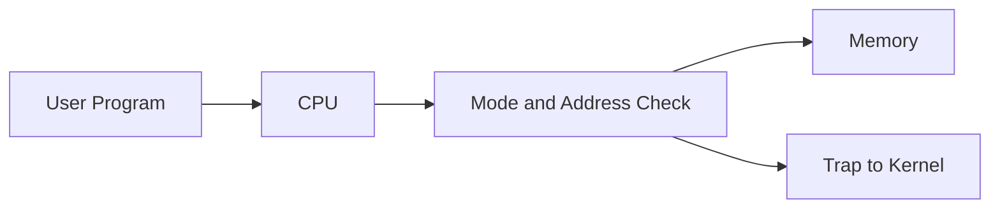
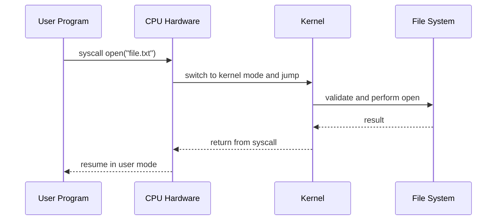

# User Mode, Kernel Mode, and the Mode Bit

This note answers one specific confusion clearly:

> If the kernel is software, how does it become privileged, and how do user programs get restricted?

The short answer is:

- The **kernel is software**
- **Privilege is hardware**
- The CPU contains a protected hardware state often explained as a **mode bit**

That mode state decides whether the current code runs as:

- **user mode**: restricted
- **kernel mode**: privileged

## 1. The Core Mental Model

Keep this picture in mind:

```text
Kernel = trusted software
Mode bit = hardware switch
CPU = enforcer
```

The kernel is not a chip and not a gate by itself.
It is code loaded into memory like other code.
What makes it special is that the **CPU hardware runs it with more authority**.

## 2. Before Protection Existed

In the old model, a program could access memory directly:

```text
Program -> CPU -> Memory
```

If the program had a bug and wrote to the wrong address, the CPU would obey.

That could overwrite:

- another program
- the helper program / early OS
- hardware control state

This is why one bad program could crash the whole machine.

## 3. After Protection Was Added

Hardware changed the path to this:

```text
Program -> CPU -> Check -> Memory
```

Now every sensitive action goes through a hardware check.



If the access is allowed, memory is touched.
If not, memory is left alone and the CPU traps into the kernel.

## 4. What the Mode Bit Is

Inside the CPU there is a tiny protected hardware state:

- `0` = user mode
- `1` = kernel mode

You can think of it as a hardware latch or flip-flop inside the CPU.

Important:

- It is **not** an ordinary variable in RAM
- User programs cannot directly write it
- The CPU checks it during privileged actions

## 5. What Changes Between User and Kernel Mode

In user mode:

- program cannot directly control devices
- program cannot directly manage memory mappings
- program cannot directly schedule other programs
- privileged instructions are blocked

In kernel mode:

- kernel can set memory rules
- kernel can handle interrupts
- kernel can talk to devices
- kernel can create and switch processes

## 6. How the CPU Knows Whether to Allow an Action

Every privileged action effectively goes through logic like this:

```text
if mode == kernel
    allow privileged path
else
    block and trap
```

This is not software `if` logic in the program.
It is hardware checking an internal CPU state before allowing certain paths.

For memory protection, the CPU also checks the requested address against installed protection rules.

So the hardware inputs are roughly:

- current mode
- requested address
- installed memory rules

## 7. Who Changes the Mode Bit

This is the exact point many people ask about.

The answer:

> User code does not freely flip the mode bit.  
> The CPU hardware changes it on specific controlled entry paths.

The common entry paths are:

1. **Boot / reset**
   - CPU starts in a hardware-defined privileged state
   - firmware and boot code run first

2. **Interrupt**
   - timer, keyboard, disk, or network event arrives
   - CPU finishes the current instruction
   - CPU switches into kernel mode and jumps to handler code

3. **Exception / trap**
   - illegal memory access
   - divide by zero
   - invalid instruction
   - CPU switches into kernel mode and jumps to a handler

4. **System call**
   - user program intentionally asks the kernel for a privileged service
   - CPU switches into kernel mode in a controlled way

So the key is:

- **kernel software does not magically promote itself**
- **CPU hardware performs the mode transition**

## 8. One Simple System Call Example

Suppose a user program wants to open a file.

### Step-by-step

1. Program runs in user mode
2. Program executes a system call instruction
3. CPU hardware:
   - saves enough state to resume later
   - flips into kernel mode
   - jumps to the kernel's syscall handler
4. Kernel validates the request
5. Kernel talks to the filesystem / device layer
6. Kernel returns
7. CPU restores user state and resumes user mode

### Flow



## 9. Why CPU Checks Alone Are Not Enough

The CPU can enforce rules, but it does not decide the policy.

The CPU can answer:

- Is this access allowed right now?

But the kernel decides:

- which process exists
- what memory belongs to it
- when it runs
- what happens if it crashes
- which device or file it may use

So:

```text
CPU = enforcer
Kernel = manager and rule-installer
```

Both are needed.

## 10. Before vs After in One Tiny Example

### Before protection

Program B writes to address 2.
CPU obeys immediately.
Program A's data gets overwritten.

### After protection

Program B writes to address 2.
CPU checks mode and memory rules.
If address 2 is not allowed:

- write is blocked
- trap happens
- kernel gets control

Program A stays safe.

## 11. The One Sentence to Remember

The kernel is software, but privilege is granted and enforced by CPU hardware through a protected mode state and controlled entry paths like interrupts, traps, and system calls.

## 12. Interview-Safe Summary

If someone asks:

> Is the kernel hardware or software?

You can answer:

> The kernel is software. What makes it special is that the CPU hardware runs it in privileged mode and blocks user programs from executing the same privileged actions directly.
