```mermaid
sequenceDiagram
    mysql-0->>mysql-0: CRASH! 💥
    Note over mysql-0: 60 seconds downtime ⏰
    mysql-0->>mysql-0: Restart
    mysql-0->>App: OK, I'm back
```

```mermaid
sequenceDiagram
    mysql-0->>mysql-0: CRASH! 💥
    mysql-1->>mysql-1: I'll be the boss now!
    Router->>mysql-1: Sending traffic to you
    Note over mysql-0: 3 seconds downtime ⏰
    mysql-0->>mysql-0: Restart
    mysql-0->>mysql-1: I'm back, you're the boss
```

# StatefulSet: Simple Explanation

## What is StatefulSet?

Think of StatefulSet like a **numbered apartment building** where each apartment keeps its stuff even if the tenant moves out and comes back.

```
Regular Deployment = Hotel rooms (generic, interchangeable)
StatefulSet = Apartments (numbered, keep your stuff)
```

---

## Simple Example: 3 MySQL Pods


**Key Points:**
- Each pod has a **name with a number** (0, 1, 2)
- Each pod has its **own disk** 
- Names and disks **never change**

---

## How StatefulSet Works: Step by Step

### Step 1: Create StatefulSet


---

### Step 2: Pods Created in Order


**Important:** Pods are created **one at a time**, not all together!

---

## What Happens if a Pod Dies?

### Without StatefulSet (Regular Deployment)

```mermaid
graph LR
    A[app-abc123] -->|crashes| B[DELETED]
    B --> C[app-xyz789]
    C --> D[New pod, new name,<br/>loses data ❌]
```



**Problem:** New pod = different name + lost data

---

### With StatefulSet

```mermaid
graph LR
    A[mysql-1] -->|crashes| B[DELETED]
    B --> C[mysql-1]
    C --> D[Same name,<br/>same disk,<br/>data preserved ✅]
```



**Benefit:** Same pod comes back with same name and data!

---

## Manual Setup vs Operator

### Manual Setup (What We Did)

```mermaid
graph TB
    You[You] -->|Write| YAML[StatefulSet YAML<br/>120 lines]
    You -->|Configure| INIT[Init scripts]
    You -->|Setup| CONFIG[MySQL config]
    
    YAML --> PODS[3 MySQL pods]
    INIT -.-> PODS
    CONFIG -.-> PODS
    
    PODS --> RESULT[Works, but...<br/>No auto-failover ❌<br/>No replication ❌<br/>You do everything 😓]
```



**You Do:**
- Write all the YAML
- Configure everything
- Fix problems manually
- No automation

---

### With Operator (Production Way)


**Operator Does:**
- Creates everything automatically
- Configures replication
- Handles failures
- Takes backups
- You just make a simple request!

---

## Simple Comparison

### What You Write

**Manual:**
```yaml
# 5 files, 250+ lines total
StatefulSet (120 lines)
Service (12 lines)
ConfigMap (30 lines)
Init script (40 lines)
Secret (8 lines)
```

**Operator:**
```yaml
# 1 file, 30 lines
kind: MySQLCluster
spec:
  replicas: 3
  storage: 10Gi
```

---

### What Happens When mysql-0 Crashes

**Manual:**


**Operator:**


---

## What Else Uses StatefulSet?

### Besides Databases


**Why?** All need:
- Stable names
- Keep their data
- Know who is who

---

## Platform Engineer's Job


**Platform Engineer:**
1. Installs the operator (one time)
2. Developers just request "I need MySQL"
3. Operator creates everything automatically

---

## The Simple Truth

### StatefulSet = Building Blocks

```
StatefulSet gives you:
✅ Numbered pods (mysql-0, mysql-1, mysql-2)
✅ Each pod keeps its disk
✅ Pods recreate with same name

But you must configure the app yourself!
```

### Operator = Smart Robot

```
Operator uses StatefulSet and adds:
✅ Automatic configuration
✅ Automatic failover
✅ Automatic backups
✅ Automatic everything!

You just say "I want 3 MySQL" and it does the rest!
```

---

## When to Use What?


---

## Summary in One Picture


---

## Key Takeaway

**StatefulSet** = Tool that gives pods stable names and storage

**Operator** = Smart robot that uses StatefulSet to build complete systems

**Our Demo** = Manual StatefulSet (for learning)

**Production** = Use Operator (for automation)

That's it! 🎉
