# Git Branching Strategies - Complete Visual Guide

> 🎯 **Purpose**: Easy-to-understand guide with visual diagrams for choosing and implementing Git branching strategies

---

## 📊 Quick Revision Table

| Strategy | Complexity | Best For | Release Cadence | Branch Types | CI/CD Need | Feature Flags |
|----------|------------|----------|-----------------|--------------|------------|---------------|
| **Git Flow** | 🔴 High | Enterprise, Mobile Apps, Versioned Software | Scheduled (Monthly/Quarterly) | 5 (main, develop, feature, release, hotfix) | Optional | No |
| **GitHub Flow** | 🟢 Low | SaaS, Startups, Open Source | Continuous | 2 (main, feature) | Recommended | Optional |
| **GitLab Flow** | 🟡 Medium | QA-heavy workflows, Staging needs | Continuous | 3-4 (main, feature, staging, production) | Required | Optional |
| **Trunk-Based** | 🟢 Low | High-velocity teams, Big Tech | Continuous (multiple/day) | 1-2 (main, short-lived) | Critical | Yes |

---

## 🤔 Why Branching Strategies Matter?


### ❌ Without a Strategy
- Developers overwrite each other's work
- Untested code reaches production
- Releases become stressful
- Nobody knows which branch is stable

### ✅ With a Strategy
- Clear rules for code flow
- Predictable releases
- Quick bug fixes
- Happy teams

---

## 1️⃣ Git Flow

> **Best For**: Enterprise projects, Mobile apps, Software with scheduled releases


### Git Flow Branch Types


### When to Use Git Flow

| ✅ Use When | ❌ Avoid When |
|-------------|---------------|
| Scheduled releases (monthly/quarterly) | Deploying multiple times per day |
| Multiple versions in production | Small teams or solo developers |
| Need formal release processes | Web apps with single live version |
| Regulated industries | Overhead slows you down |

### Git Flow Commands Cheat Sheet

```bash
# Start a feature
git checkout develop
git checkout -b feature/user-dashboard

# Finish a feature
git checkout develop
git merge --no-ff feature/user-dashboard

# Create release
git checkout develop
git checkout -b release/2.0.0

# Finish release
git checkout main
git merge --no-ff release/2.0.0
git tag -a v2.0.0 -m "Release 2.0.0"
git checkout develop
git merge --no-ff release/2.0.0

# Emergency hotfix
git checkout main
git checkout -b hotfix/fix-crash
# fix the bug...
git checkout main
git merge --no-ff hotfix/fix-crash
git tag -a v2.0.1 -m "Hotfix"
git checkout develop
git merge --no-ff hotfix/fix-crash
```

---

## 2️⃣ GitHub Flow

> **Best For**: SaaS products, Startups, Open Source, Continuous deployment


### GitHub Flow Rules

```mermaid
flowchart LR
    subgraph "📋 Simple Rules"
        A[1️⃣ main is ALWAYS<br/>deployable]
        B[2️⃣ Branch from main<br/>for every change]
        C[3️⃣ Open Pull Request<br/>for review]
        D[4️⃣ Merge after<br/>approval + CI]
        E[5️⃣ Deploy<br/>immediately]
    end
    
    A --> B --> C --> D --> E
```



### GitHub Flow Workflow

```mermaid
sequenceDiagram
    participant Dev as 👩‍💻 Developer
    participant Feature as 🌿 Feature Branch
    participant PR as 📝 Pull Request
    participant CI as ⚙️ CI/CD
    participant Main as 🏠 Main
    participant Prod as 🚀 Production

    Dev->>Feature: git checkout -b feature/xyz
    Dev->>Feature: Write code + commits
    Dev->>PR: Open Pull Request
    PR->>CI: Run tests, lint, build
    CI-->>PR: ✅ All checks pass
    PR->>Main: Merge (after review)
    Main->>Prod: Auto deploy
```



### When to Use GitHub Flow

| ✅ Use When | ❌ Avoid When |
|-------------|---------------|
| Web applications | Multiple versions in production |
| Continuous deployment | Need staging environment |
| Small to medium teams | Strict QA processes |
| Single live version | Scheduled releases |

### GitHub Flow Commands

```bash
# Create feature branch
git checkout main
git pull origin main
git checkout -b feature/add-search

# Work and commit
git add .
git commit -m "feat: add search functionality"
git push -u origin feature/add-search

# After PR merge, clean up
git checkout main
git pull origin main
git branch -d feature/add-search
```

---

## 3️⃣ GitLab Flow

> **Best For**: Teams needing staging/QA environments, Medium+ teams


### GitLab Flow with Environments


### GitLab Flow Commands

```bash
# Develop feature
git checkout main
git checkout -b feature/notifications
# work...
git push -u origin feature/notifications
# Create Merge Request via GitLab UI

# After merge to main, promote to staging
git checkout staging
git merge main
git push origin staging
# Staging deployment triggers

# After QA, promote to production
git checkout production
git merge staging
git push origin production
# Production deployment triggers
```

---

## 4️⃣ Trunk-Based Development

> **Best For**: Google, Meta, Amazon-style high-velocity teams


### Trunk-Based Principles


### Feature Flags Flow

```mermaid
flowchart LR
    subgraph "🏗️ Development"
        CODE[Write Code<br/>Behind Flag]
        MERGE[Merge to Main<br/>Flag OFF]
    end
    
    subgraph "🧪 Rollout"
        INT[Enable for<br/>Internal Users]
        BETA[Enable for<br/>Beta Users]
        ALL[Enable for<br/>Everyone]
    end
    
    subgraph "🧹 Cleanup"
        REMOVE[Remove Flag<br/>Remove Legacy Code]
    end
    
    CODE --> MERGE --> INT --> BETA --> ALL --> REMOVE
```



### When to Use Trunk-Based

| ✅ Use When | ❌ Avoid When |
|-------------|---------------|
| Strong CI/CD pipeline | Weak or no test coverage |
| Deploying multiple times/day | Need formal release process |
| Experienced teams | Can't use feature flags |
| Web applications | Multiple versions needed |

---

## 📝 Branch Naming Conventions


### Naming Rules

| Rule | Example |
|------|---------|
| Use lowercase | ✅ `feature/user-auth` ❌ `Feature/User-Auth` |
| Use hyphens (kebab-case) | ✅ `feature/add-login` ❌ `feature/add_login` |
| Keep under 50 chars | ✅ `feature/auth` ❌ `feature/user-authentication-system-with-jwt` |
| Include ticket numbers | ✅ `feature/PROJ-1234-user-auth` |
| Be descriptive | ✅ `bugfix/fix-payment-null` ❌ `bugfix/fix-bug` |

---

## 🔀 Merge Strategies Comparison

```mermaid
flowchart TB
    subgraph "Original State"
        O1[main: A → B → C]
        O2[feature: D → E → F]
    end
    
    subgraph "Merge Commit"
        M1["main: A → B → C ─────→ M"]
        M2["         ↘ D → E → F ↗"]
    end
    
    subgraph "Squash Merge"
        S1["main: A → B → C → S"]
        S2["(S = D + E + F combined)"]
    end
    
    subgraph "Rebase Merge"
        R1["main: A → B → C → D' → E' → F'"]
        R2["(Linear history, no merge commit)"]
    end
```



### Merge Strategy Table

| Strategy | Command | Pros | Cons | Best For |
|----------|---------|------|------|----------|
| **Merge Commit** | `git merge --no-ff` | Full history, easy to revert feature | Cluttered history | Git Flow releases |
| **Squash Merge** | `git merge --squash` | Clean history, one commit per feature | Loses granular commits | GitHub Flow |
| **Rebase Merge** | `git rebase` then merge | Linear history, no merge commits | Rewrites hashes | Trunk-Based |

---

## 🛡️ Branch Protection Rules


---

## ⚔️ Handling Merge Conflicts


### Conflict Resolution Commands

```bash
# See conflicted files
git status

# After resolving manually
git add <resolved-file>

# For merge conflicts
git commit

# For rebase conflicts
git rebase --continue

# To abort and start over
git merge --abort
# or
git rebase --abort

# Enable auto-resolution for repeated conflicts
git config --global rerere.enabled true
```

---

## 🎯 Decision Flowchart: Which Strategy?


---

## 📚 Summary: Key Takeaways


---

## 🔗 Quick Reference Commands

| Action | Command |
|--------|---------|
| Create branch | `git checkout -b feature/xyz` |
| Switch branch | `git checkout main` |
| Update from main | `git pull origin main` |
| Merge with commit | `git merge --no-ff feature/xyz` |
| Squash merge | `git merge --squash feature/xyz` |
| Rebase | `git rebase main` |
| Create tag | `git tag -a v1.0.0 -m "Release"` |
| Delete local branch | `git branch -d feature/xyz` |
| Delete remote branch | `git push origin --delete feature/xyz` |
| View branches | `git branch -a` |

---

## 🔧 Git Merge - Complete Guide

### Types of Merges

```mermaid
flowchart TB
    subgraph "Fast-Forward Merge"
        FF1[main: A → B → C]
        FF2[feature: C → D → E]
        FF3["Result: A → B → C → D → E"]
        FF1 --> FF3
        FF2 --> FF3
    end
    
    subgraph "3-Way Merge"
        TW1[main: A → B → C → F]
        TW2[feature: C → D → E]
        TW3["Result: A → B → C → F → M<br/>         ↖ D → E ↗"]
        TW1 --> TW3
        TW2 --> TW3
    end
```



### Merge Commands

```bash
# Fast-forward merge (when possible)
git checkout main
git merge feature/xyz
# Result: Linear history, no merge commit

# Force merge commit (recommended for features)
git checkout main
git merge --no-ff feature/xyz
# Result: Creates merge commit even if fast-forward possible

# Merge with custom message
git merge --no-ff feature/xyz -m "Merge: Add user authentication"

# Preview merge without committing
git merge --no-commit feature/xyz
git diff --staged  # Review changes
git merge --abort  # Cancel if not happy
# or
git commit         # Proceed with merge
```

### Resolving Merge Conflicts - All Methods

```mermaid
flowchart TD
    CONFLICT[⚠️ CONFLICT<br/>Automatic merge failed]
    
    CONFLICT --> M1[Method 1:<br/>Manual Edit]
    CONFLICT --> M2[Method 2:<br/>Keep Ours]
    CONFLICT --> M3[Method 3:<br/>Keep Theirs]
    CONFLICT --> M4[Method 4:<br/>VS Code Tool]
    CONFLICT --> M5[Method 5:<br/>Git Mergetool]
    
    M1 --> RESOLVE[✅ Resolved]
    M2 --> RESOLVE
    M3 --> RESOLVE
    M4 --> RESOLVE
    M5 --> RESOLVE
    
    style CONFLICT fill:#ffcdd2
    style RESOLVE fill:#c8e6c9
```



### Method 1: Manual Edit

```bash
# Conflict markers in file look like:
<<<<<<< HEAD
const API_URL = "https://api.production.com";
=======
const API_URL = "https://api.staging.com";
>>>>>>> feature/update-api

# Steps:
# 1. Open file in editor
# 2. Decide what to keep (or combine both)
# 3. Remove ALL conflict markers (<<<<<<<, =======, >>>>>>>)
# 4. Save file

# After editing:
git add src/config.js
git commit -m "Merge: resolve API URL conflict"
```

### Method 2: Keep Our Version (Current Branch)

```bash
# Keep entire file from current branch (ours)
git checkout --ours src/config.js
git add src/config.js

# During merge, prefer our version for all conflicts
git merge -X ours feature/xyz

# For specific file during conflict
git checkout --ours -- path/to/file
```

### Method 3: Keep Their Version (Incoming Branch)

```bash
# Keep entire file from incoming branch (theirs)
git checkout --theirs src/config.js
git add src/config.js

# During merge, prefer their version for all conflicts
git merge -X theirs feature/xyz

# For specific file during conflict
git checkout --theirs -- path/to/file
```

### Method 4: VS Code Built-in Tool


### Method 5: Git Mergetool

```bash
# Configure mergetool (one-time setup)
git config --global merge.tool vscode
git config --global mergetool.vscode.cmd 'code --wait $MERGED'

# Or use other tools
git config --global merge.tool vimdiff
git config --global merge.tool meld

# Launch mergetool during conflict
git mergetool

# After resolving all files
git commit
```

### Conflict Resolution Cheat Sheet

| Situation | Command |
|-----------|---------|
| See all conflicted files | `git status` |
| Keep our version (entire file) | `git checkout --ours <file>` |
| Keep their version (entire file) | `git checkout --theirs <file>` |
| Abort merge completely | `git merge --abort` |
| After manual resolution | `git add <file>` → `git commit` |
| Auto-resolve future same conflicts | `git config --global rerere.enabled true` |
| See diff during conflict | `git diff` |
| See merge base | `git merge-base main feature` |

---

## 📦 Git Stash - Complete Guide

> **What is Stash?** Temporarily save uncommitted changes without committing them

```mermaid
flowchart LR
    subgraph "Working Directory"
        WD[Uncommitted<br/>Changes]
    end
    
    subgraph "Stash Stack"
        S0[stash@{0}]
        S1[stash@{1}]
        S2[stash@{2}]
    end
    
    subgraph "Clean State"
        CLEAN[Ready to<br/>switch branch]
    end
    
    WD -->|git stash| S0
    S0 -->|git stash pop| WD
    WD -->|git stash| CLEAN
    
    style WD fill:#fff9c4
    style CLEAN fill:#c8e6c9
```

### When to Use Stash?

```mermaid
mindmap
  root((Git Stash<br/>Use Cases))
    Switch Branches
      Urgent bug fix needed
      Don't want to commit WIP
    Pull Latest Changes
      Can't pull with local changes
      Stash → Pull → Pop
    Quick Experiment
      Try something
      Stash current work
      Restore if experiment fails
    Code Review
      Reviewer needs clean state
      Stash your changes
```

### Stash Commands

```bash
# Basic stash (saves tracked files)
git stash

# Stash with message (recommended!)
git stash push -m "WIP: user authentication form"

# Stash including untracked files
git stash -u
# or
git stash --include-untracked

# Stash everything (including ignored files)
git stash -a
# or
git stash --all

# Stash specific files only
git stash push -m "stash only config" src/config.js src/settings.js

# Stash with patch (interactive selection)
git stash -p
```

### View & Manage Stashes

```bash
# List all stashes
git stash list
# Output:
# stash@{0}: WIP on main: abc1234 WIP: user auth form
# stash@{1}: WIP on main: def5678 API changes
# stash@{2}: On feature: 789abc0 Temp save

# Show stash contents (diff)
git stash show                    # Summary
git stash show -p                 # Full diff
git stash show stash@{1}          # Specific stash
git stash show -p stash@{2}       # Full diff of specific stash
```

### Apply & Remove Stashes

```mermaid
flowchart TD
    STASH[Stash Stack]
    
    STASH --> POP[git stash pop<br/>Apply + Delete]
    STASH --> APPLY[git stash apply<br/>Apply + Keep]
    STASH --> DROP[git stash drop<br/>Delete only]
    STASH --> CLEAR[git stash clear<br/>Delete ALL]
    
    POP --> |Success| GONE[Stash removed]
    POP --> |Conflict| KEPT[Stash kept]
    APPLY --> KEPT2[Stash kept]
    
    style POP fill:#fff9c4
    style APPLY fill:#e1f5fe
    style DROP fill:#ffcdd2
    style CLEAR fill:#ffcdd2
```

```bash
# Apply most recent stash AND remove it
git stash pop

# Apply most recent stash BUT keep it
git stash apply

# Apply specific stash
git stash apply stash@{2}
git stash pop stash@{1}

# Delete most recent stash (without applying)
git stash drop

# Delete specific stash
git stash drop stash@{2}

# Delete ALL stashes (careful!)
git stash clear
```

### Stash to New Branch

```bash
# Create new branch from stash (useful for complex stashed work)
git stash branch feature/from-stash stash@{0}
# Creates branch, checks it out, applies stash, drops stash
```

### Stash Workflow Examples

```bash
# Scenario: Urgent bug fix while working on feature
git stash push -m "WIP: dashboard feature"
git checkout main
git checkout -b hotfix/urgent-bug
# ... fix bug, commit, merge ...
git checkout feature/dashboard
git stash pop
# Continue working on feature

# Scenario: Pull with local changes
git stash
git pull origin main
git stash pop
# Resolve conflicts if any

# Scenario: Try experimental code
git stash push -m "before experiment"
# ... make experimental changes ...
# If experiment fails:
git checkout .                    # Discard experiment
git stash pop                     # Restore original
# If experiment succeeds:
git stash drop                    # Delete backup
```

### Stash Quick Reference

| Action | Command |
|--------|---------|
| Save changes | `git stash` or `git stash push -m "message"` |
| Include untracked | `git stash -u` |
| List stashes | `git stash list` |
| View stash diff | `git stash show -p` |
| Apply & remove | `git stash pop` |
| Apply & keep | `git stash apply` |
| Delete one stash | `git stash drop stash@{n}` |
| Delete all stashes | `git stash clear` |
| Stash to branch | `git stash branch <branch-name>` |

---

## 🔄 Daily Git Commands - Essential Reference

### Daily Workflow

```mermaid
flowchart TD
    START[Start Day] --> PULL[git pull<br/>Get latest]
    PULL --> BRANCH[git checkout -b<br/>Create feature branch]
    BRANCH --> CODE[Write Code]
    CODE --> STATUS[git status<br/>Check changes]
    STATUS --> ADD[git add<br/>Stage files]
    ADD --> COMMIT[git commit<br/>Save changes]
    COMMIT --> MORE{More work?}
    MORE -->|Yes| CODE
    MORE -->|No| PUSH[git push<br/>Upload to remote]
    PUSH --> PR[Create PR]
    
    style START fill:#e8f5e9
    style PR fill:#c8e6c9
```

### Status & Information

```bash
# Check current state
git status                        # Full status
git status -s                     # Short format

# View commit history
git log                           # Full log
git log --oneline                 # Compact
git log --oneline -10             # Last 10 commits
git log --graph --oneline --all   # Visual branch graph

# Show current branch
git branch                        # Local branches
git branch -a                     # All branches (including remote)
git branch -vv                    # With tracking info

# Show remote URLs
git remote -v
```

### Staging & Committing

```bash
# Stage files
git add file.js                   # Single file
git add src/                      # Directory
git add .                         # All changes
git add -p                        # Interactive (select hunks)

# Unstage files
git reset HEAD file.js            # Unstage single file
git reset HEAD                    # Unstage all

# Commit
git commit -m "feat: add login"   # With message
git commit                        # Opens editor
git commit -am "message"          # Add tracked + commit
git commit --amend                # Edit last commit
git commit --amend --no-edit      # Add to last commit (no message change)
```

### Undoing Changes

```mermaid
flowchart TD
    subgraph "Not Staged"
        A[Modified file] -->|git checkout -- file| B[Discard changes]
        A -->|git restore file| B
    end
    
    subgraph "Staged"
        C[Staged file] -->|git reset HEAD file| D[Unstaged]
        C -->|git restore --staged file| D
    end
    
    subgraph "Committed"
        E[Last commit] -->|git reset --soft HEAD~1| F[Uncommit, keep staged]
        E -->|git reset HEAD~1| G[Uncommit, keep changes]
        E -->|git reset --hard HEAD~1| H[Uncommit, discard all]
        E -->|git revert HEAD| I[New commit undoing changes]
    end
    
    style B fill:#ffcdd2
    style H fill:#ffcdd2
    style I fill:#c8e6c9
```

```bash
# Discard local changes (not staged)
git checkout -- file.js           # Single file
git checkout -- .                 # All files
git restore file.js               # Modern syntax

# Discard staged changes
git reset HEAD file.js            # Unstage
git restore --staged file.js      # Modern syntax

# Undo last commit (keep changes)
git reset --soft HEAD~1           # Keep staged
git reset HEAD~1                  # Keep unstaged
git reset --hard HEAD~1           # Discard everything (DANGER!)

# Undo pushed commit (safe for shared branches)
git revert HEAD                   # Creates new "undo" commit
git revert abc1234                # Revert specific commit
```

### Working with Remotes

```bash
# Fetch & Pull
git fetch                         # Download changes (don't merge)
git fetch --all                   # From all remotes
git pull                          # Fetch + merge
git pull --rebase                 # Fetch + rebase (cleaner history)

# Push
git push                          # Push current branch
git push -u origin feature/xyz    # Push & set upstream
git push --force-with-lease       # Safe force push (for rebased branches)
git push origin --delete branch   # Delete remote branch

# Show remote details
git remote show origin
```

### Diff & Compare

```bash
# View changes
git diff                          # Unstaged changes
git diff --staged                 # Staged changes
git diff HEAD                     # All changes since last commit
git diff main..feature            # Between branches
git diff abc123..def456           # Between commits
git diff --stat                   # Summary only

# Compare files
git diff HEAD -- file.js          # Changes in specific file
git diff main:file.js feature:file.js  # File between branches
```

### Searching & Finding

```bash
# Search commit messages
git log --grep="bug fix"
git log --grep="JIRA-123"

# Search code changes
git log -S "functionName"         # Commits that add/remove string
git log -p -S "functionName"      # With diffs

# Find who changed a line
git blame file.js                 # Show author per line
git blame -L 10,20 file.js        # Specific lines

# Search in files
git grep "searchTerm"             # Search working directory
git grep "searchTerm" HEAD~5      # Search at specific commit
```

### Cleaning Up

```bash
# Remove untracked files
git clean -n                      # Dry run (show what would be deleted)
git clean -f                      # Remove untracked files
git clean -fd                     # Remove untracked files AND directories
git clean -fdx                    # Also remove ignored files (careful!)

# Prune remote tracking branches
git fetch --prune                 # Remove deleted remote branches
git remote prune origin           # Same effect

# Delete merged branches
git branch --merged | grep -v main | xargs git branch -d
```

---

## 📋 Git Daily Commands Cheat Sheet

### Most Used (Memorize These!)

| Command | Purpose |
|---------|---------|
| `git status` | See what's changed |
| `git add .` | Stage all changes |
| `git commit -m "msg"` | Save changes |
| `git push` | Upload to remote |
| `git pull` | Download & merge |
| `git checkout -b name` | Create & switch branch |
| `git stash` | Temporarily save changes |
| `git stash pop` | Restore stashed changes |
| `git log --oneline` | View history |
| `git diff` | See changes |

### Undo Operations

| What to Undo | Command |
|--------------|---------|
| Unstaged changes | `git checkout -- file` or `git restore file` |
| Staged changes | `git reset HEAD file` or `git restore --staged file` |
| Last commit (keep changes) | `git reset HEAD~1` |
| Last commit (discard) | `git reset --hard HEAD~1` |
| Pushed commit | `git revert HEAD` |
| Merge in progress | `git merge --abort` |
| Rebase in progress | `git rebase --abort` |

### Branch Operations

| Action | Command |
|--------|---------|
| List branches | `git branch -a` |
| Create branch | `git branch name` |
| Create & switch | `git checkout -b name` |
| Switch branch | `git checkout name` or `git switch name` |
| Delete local | `git branch -d name` |
| Delete remote | `git push origin --delete name` |
| Rename branch | `git branch -m old new` |

### Sync Operations

| Action | Command |
|--------|---------|
| Download changes | `git fetch` |
| Download & merge | `git pull` |
| Download & rebase | `git pull --rebase` |
| Upload changes | `git push` |
| Set upstream | `git push -u origin branch` |
| Force push (safe) | `git push --force-with-lease` |

---

## 🚨 Emergency Commands

```mermaid
flowchart TD
    PANIC[😱 Something went wrong!]
    
    PANIC --> Q1{What happened?}
    
    Q1 -->|Wrong branch| A1[git checkout correct-branch]
    Q1 -->|Bad commit| A2{Pushed?}
    Q1 -->|Lost changes| A3[git reflog + git checkout]
    Q1 -->|Merge mess| A4[git merge --abort]
    Q1 -->|Rebase mess| A5[git rebase --abort]
    
    A2 -->|No| A2a[git reset HEAD~1]
    A2 -->|Yes| A2b[git revert HEAD]
    
    style PANIC fill:#ffcdd2
    style A1 fill:#c8e6c9
    style A2a fill:#c8e6c9
    style A2b fill:#c8e6c9
    style A3 fill:#c8e6c9
    style A4 fill:#c8e6c9
    style A5 fill:#c8e6c9
```

```bash
# RECOVER DELETED/LOST COMMITS
git reflog                        # Shows ALL recent actions
git checkout abc1234              # Go to specific point
git branch recovery abc1234       # Create branch from that point

# UNDO EVERYTHING AND START FRESH
git fetch origin
git reset --hard origin/main      # Match remote exactly (LOSES LOCAL!)

# STUCK IN MIDDLE OF OPERATION
git merge --abort                 # Cancel merge
git rebase --abort                # Cancel rebase
git cherry-pick --abort           # Cancel cherry-pick

# COMMITTED TO WRONG BRANCH
git log --oneline -1              # Note the commit hash
git reset HEAD~1                  # Undo commit (keep changes)
git stash                         # Stash changes
git checkout correct-branch
git stash pop                     # Apply changes
git commit -m "message"           # Commit on correct branch
```

---

> 💡 **Remember**: Start with the simplest strategy (GitHub Flow) and only add complexity when you have a concrete problem that demands it!
