# Git Branching Strategies - Complete Visual Guide

> 🎯 **Purpose**: Easy-to-understand guide with visual diagrams for choosing and implementing Git branching strategies

---

## 📊 Quick Revision Table

| Strategy | Complexity | Best For | Release Cadence | Branch Types | CI/CD Need | Feature Flags |
|----------|------------|----------|-----------------|--------------|------------|---------------|
| **Git Flow** | 🔴 High | Enterprise, Mobile Apps, Versioned Software | Scheduled (Monthly/Quarterly) | 5 (main, develop, feature, release, hotfix) | Optional | No |
| **GitHub Flow** | 🟢 Low | SaaS, Startups, Open Source | Continuous | 2 (main, feature) | Recommended | Optional |
| **GitLab Flow** | 🟡 Medium | QA-heavy workflows, Staging needs | Continuous | 3-4 (main, feature, staging, production) | Required | Optional |
| **Trunk-Based** | 🟢 Low | High-velocity teams, Big Tech | Continuous (multiple/day) | 1-2 (main, short-lived) | Critical | Yes |

---

## 🤔 Why Branching Strategies Matter?


### ❌ Without a Strategy
- Developers overwrite each other's work
- Untested code reaches production
- Releases become stressful
- Nobody knows which branch is stable

### ✅ With a Strategy
- Clear rules for code flow
- Predictable releases
- Quick bug fixes
- Happy teams

---

## 1️⃣ Git Flow

> **Best For**: Enterprise projects, Mobile apps, Software with scheduled releases


### Git Flow Branch Types


### When to Use Git Flow

| ✅ Use When | ❌ Avoid When |
|-------------|---------------|
| Scheduled releases (monthly/quarterly) | Deploying multiple times per day |
| Multiple versions in production | Small teams or solo developers |
| Need formal release processes | Web apps with single live version |
| Regulated industries | Overhead slows you down |

### Git Flow Commands Cheat Sheet

```bash
# Start a feature
git checkout develop
git checkout -b feature/user-dashboard

# Finish a feature
git checkout develop
git merge --no-ff feature/user-dashboard

# Create release
git checkout develop
git checkout -b release/2.0.0

# Finish release
git checkout main
git merge --no-ff release/2.0.0
git tag -a v2.0.0 -m "Release 2.0.0"
git checkout develop
git merge --no-ff release/2.0.0

# Emergency hotfix
git checkout main
git checkout -b hotfix/fix-crash
# fix the bug...
git checkout main
git merge --no-ff hotfix/fix-crash
git tag -a v2.0.1 -m "Hotfix"
git checkout develop
git merge --no-ff hotfix/fix-crash
```

---

## 2️⃣ GitHub Flow

> **Best For**: SaaS products, Startups, Open Source, Continuous deployment


### GitHub Flow Rules

```mermaid
flowchart LR
    subgraph "📋 Simple Rules"
        A[1️⃣ main is ALWAYS<br/>deployable]
        B[2️⃣ Branch from main<br/>for every change]
        C[3️⃣ Open Pull Request<br/>for review]
        D[4️⃣ Merge after<br/>approval + CI]
        E[5️⃣ Deploy<br/>immediately]
    end
    
    A --> B --> C --> D --> E
```



### GitHub Flow Workflow

```mermaid
sequenceDiagram
    participant Dev as 👩‍💻 Developer
    participant Feature as 🌿 Feature Branch
    participant PR as 📝 Pull Request
    participant CI as ⚙️ CI/CD
    participant Main as 🏠 Main
    participant Prod as 🚀 Production

    Dev->>Feature: git checkout -b feature/xyz
    Dev->>Feature: Write code + commits
    Dev->>PR: Open Pull Request
    PR->>CI: Run tests, lint, build
    CI-->>PR: ✅ All checks pass
    PR->>Main: Merge (after review)
    Main->>Prod: Auto deploy
```



### When to Use GitHub Flow

| ✅ Use When | ❌ Avoid When |
|-------------|---------------|
| Web applications | Multiple versions in production |
| Continuous deployment | Need staging environment |
| Small to medium teams | Strict QA processes |
| Single live version | Scheduled releases |

### GitHub Flow Commands

```bash
# Create feature branch
git checkout main
git pull origin main
git checkout -b feature/add-search

# Work and commit
git add .
git commit -m "feat: add search functionality"
git push -u origin feature/add-search

# After PR merge, clean up
git checkout main
git pull origin main
git branch -d feature/add-search
```

---

## 3️⃣ GitLab Flow

> **Best For**: Teams needing staging/QA environments, Medium+ teams


### GitLab Flow with Environments


### GitLab Flow Commands

```bash
# Develop feature
git checkout main
git checkout -b feature/notifications
# work...
git push -u origin feature/notifications
# Create Merge Request via GitLab UI

# After merge to main, promote to staging
git checkout staging
git merge main
git push origin staging
# Staging deployment triggers

# After QA, promote to production
git checkout production
git merge staging
git push origin production
# Production deployment triggers
```

---

## 4️⃣ Trunk-Based Development

> **Best For**: Google, Meta, Amazon-style high-velocity teams


### Trunk-Based Principles


### Feature Flags Flow

```mermaid
flowchart LR
    subgraph "🏗️ Development"
        CODE[Write Code<br/>Behind Flag]
        MERGE[Merge to Main<br/>Flag OFF]
    end
    
    subgraph "🧪 Rollout"
        INT[Enable for<br/>Internal Users]
        BETA[Enable for<br/>Beta Users]
        ALL[Enable for<br/>Everyone]
    end
    
    subgraph "🧹 Cleanup"
        REMOVE[Remove Flag<br/>Remove Legacy Code]
    end
    
    CODE --> MERGE --> INT --> BETA --> ALL --> REMOVE
```



### When to Use Trunk-Based

| ✅ Use When | ❌ Avoid When |
|-------------|---------------|
| Strong CI/CD pipeline | Weak or no test coverage |
| Deploying multiple times/day | Need formal release process |
| Experienced teams | Can't use feature flags |
| Web applications | Multiple versions needed |

---

## 📝 Branch Naming Conventions


### Naming Rules

| Rule | Example |
|------|---------|
| Use lowercase | ✅ `feature/user-auth` ❌ `Feature/User-Auth` |
| Use hyphens (kebab-case) | ✅ `feature/add-login` ❌ `feature/add_login` |
| Keep under 50 chars | ✅ `feature/auth` ❌ `feature/user-authentication-system-with-jwt` |
| Include ticket numbers | ✅ `feature/PROJ-1234-user-auth` |
| Be descriptive | ✅ `bugfix/fix-payment-null` ❌ `bugfix/fix-bug` |

---

## 🔀 Merge Strategies Comparison

```mermaid
flowchart TB
    subgraph "Original State"
        O1[main: A → B → C]
        O2[feature: D → E → F]
    end
    
    subgraph "Merge Commit"
        M1["main: A → B → C ─────→ M"]
        M2["         ↘ D → E → F ↗"]
    end
    
    subgraph "Squash Merge"
        S1["main: A → B → C → S"]
        S2["(S = D + E + F combined)"]
    end
    
    subgraph "Rebase Merge"
        R1["main: A → B → C → D' → E' → F'"]
        R2["(Linear history, no merge commit)"]
    end
```



### Merge Strategy Table

| Strategy | Command | Pros | Cons | Best For |
|----------|---------|------|------|----------|
| **Merge Commit** | `git merge --no-ff` | Full history, easy to revert feature | Cluttered history | Git Flow releases |
| **Squash Merge** | `git merge --squash` | Clean history, one commit per feature | Loses granular commits | GitHub Flow |
| **Rebase Merge** | `git rebase` then merge | Linear history, no merge commits | Rewrites hashes | Trunk-Based |

---

## 🛡️ Branch Protection Rules


---

## ⚔️ Handling Merge Conflicts


### Conflict Resolution Commands

```bash
# See conflicted files
git status

# After resolving manually
git add <resolved-file>

# For merge conflicts
git commit

# For rebase conflicts
git rebase --continue

# To abort and start over
git merge --abort
# or
git rebase --abort

# Enable auto-resolution for repeated conflicts
git config --global rerere.enabled true
```

---

## 🎯 Decision Flowchart: Which Strategy?


---

## 📚 Summary: Key Takeaways


---

## 🔗 Quick Reference Commands

| Action | Command |
|--------|---------|
| Create branch | `git checkout -b feature/xyz` |
| Switch branch | `git checkout main` |
| Update from main | `git pull origin main` |
| Merge with commit | `git merge --no-ff feature/xyz` |
| Squash merge | `git merge --squash feature/xyz` |
| Rebase | `git rebase main` |
| Create tag | `git tag -a v1.0.0 -m "Release"` |
| Delete local branch | `git branch -d feature/xyz` |
| Delete remote branch | `git push origin --delete feature/xyz` |
| View branches | `git branch -a` |

---

> 💡 **Remember**: Start with the simplest strategy (GitHub Flow) and only add complexity when you have a concrete problem that demands it!
