# Kubernetes High Availability Architecture - Complete Visual Guide

> 🎯 **Purpose**: Easy-to-understand guide with visual diagrams for designing and implementing HA applications in Kubernetes

---

## 📊 Quick Revision Table - HA Strategies

| Strategy | Purpose | Complexity | Use Case | Key Config |
|----------|---------|------------|----------|------------|
| **Pod Replicas** | 🟢 Basic | Low | All apps | `replicas: 3` |
| **Pod Disruption Budget** | 🟢 Basic | Low | Prevent downtime during updates | `minAvailable: 2` |
| **Topology Spread** | 🟡 Medium | Medium | Spread across zones/nodes | `topologySpreadConstraints` |
| **Pod Anti-Affinity** | 🟡 Medium | Medium | Never co-locate pods | `podAntiAffinity` |
| **Node Affinity** | 🟡 Medium | Medium | Target specific nodes | `nodeAffinity` |
| **Multi-Zone Deployment** | 🔴 High | High | Zone failure tolerance | Multiple strategies combined |
| **Multi-Region** | 🔴 High | Very High | Region failure tolerance | Federation/GitOps |

---

## 🤔 Why High Availability Matters?


### The Cost of Downtime

```mermaid
flowchart LR
    subgraph "Without HA"
        A[Single Pod] -->|Node Dies| B[💀 App Down]
        B --> C[😡 Users Impacted]
        C --> D[💸 Revenue Lost]
    end
    
    subgraph "With HA"
        E[Multiple Pods] -->|Node Dies| F[✅ Other Pods Serve]
        F --> G[😊 Users Unaffected]
        G --> H[💰 Business Continues]
    end
    
    style B fill:#ffcdd2
    style D fill:#ffcdd2
    style F fill:#c8e6c9
    style H fill:#c8e6c9
```



---

## 1️⃣ Pod Replicas - The Foundation

> **Basic Rule**: Never run production workloads with `replicas: 1`

```mermaid
flowchart TB
    subgraph "❌ Single Replica"
        S1[Pod] --> N1[Node 1]
        N1 -->|Node Fails| DEAD[💀 Service Down]
    end
    
    subgraph "✅ Multiple Replicas"
        P1[Pod 1] --> N2[Node 1]
        P2[Pod 2] --> N3[Node 2]
        P3[Pod 3] --> N4[Node 3]
        N2 -->|Node Fails| STILL[✅ Service Up]
        N3 --> STILL
        N4 --> STILL
    end
    
    style DEAD fill:#ffcdd2
    style STILL fill:#c8e6c9
```



### Basic Deployment with Replicas

```yaml
apiVersion: apps/v1
kind: Deployment
metadata:
  name: my-app
spec:
  replicas: 3  # 👈 Minimum 3 for HA
  selector:
    matchLabels:
      app: my-app
  template:
    metadata:
      labels:
        app: my-app
    spec:
      containers:
      - name: app
        image: my-app:v1
        resources:
          requests:
            cpu: 100m
            memory: 128Mi
          limits:
            cpu: 500m
            memory: 512Mi
        readinessProbe:  # 👈 Essential for HA
          httpGet:
            path: /health
            port: 8080
          initialDelaySeconds: 5
          periodSeconds: 10
        livenessProbe:   # 👈 Auto-healing
          httpGet:
            path: /health
            port: 8080
          initialDelaySeconds: 15
          periodSeconds: 20
```

### Replica Count Guidelines

| App Type | Min Replicas | Recommended | Notes |
|----------|-------------|-------------|-------|
| Stateless API | 3 | 3-5 | Scale with HPA |
| Web Frontend | 3 | 3-10 | Based on traffic |
| Background Worker | 2 | 2-5 | Depends on queue depth |
| Stateful (DB) | 3 | 3-5 | Odd numbers for quorum |
| Critical Services | 5 | 5-7 | Higher redundancy |

---

## 2️⃣ Pod Disruption Budget (PDB)

> **Purpose**: Guarantee minimum available pods during voluntary disruptions (upgrades, drains)

```mermaid
flowchart TD
    subgraph "Without PDB"
        A1[Node Drain] --> B1[All pods evicted]
        B1 --> C1[💀 Downtime!]
    end
    
    subgraph "With PDB"
        A2[Node Drain] --> B2{Check PDB}
        B2 -->|Would violate| C2[❌ Eviction blocked]
        B2 -->|Safe| D2[✅ Evict one pod]
        D2 --> E2[Wait for replacement]
        E2 --> B2
    end
    
    style C1 fill:#ffcdd2
    style C2 fill:#fff9c4
    style D2 fill:#c8e6c9
```



### PDB Configuration Options


### PDB YAML Examples

```yaml
# Option 1: Minimum available (absolute number)
apiVersion: policy/v1
kind: PodDisruptionBudget
metadata:
  name: my-app-pdb
spec:
  minAvailable: 2  # At least 2 pods must be running
  selector:
    matchLabels:
      app: my-app
---
# Option 2: Maximum unavailable (absolute number)
apiVersion: policy/v1
kind: PodDisruptionBudget
metadata:
  name: my-app-pdb
spec:
  maxUnavailable: 1  # At most 1 pod can be down
  selector:
    matchLabels:
      app: my-app
---
# Option 3: Percentage-based
apiVersion: policy/v1
kind: PodDisruptionBudget
metadata:
  name: my-app-pdb
spec:
  minAvailable: 80%  # 80% of replicas must be up
  selector:
    matchLabels:
      app: my-app
```

### PDB Best Practices

| Replicas | Recommended PDB | Why |
|----------|-----------------|-----|
| 3 pods | `minAvailable: 2` or `maxUnavailable: 1` | Maintains quorum |
| 5 pods | `minAvailable: 3` or `maxUnavailable: 2` | Allows faster drains |
| 10 pods | `maxUnavailable: 25%` | Percentage scales better |
| Critical | `minAvailable: N-1` | Maximum protection |

---

## 3️⃣ Topology Spread Constraints

> **Purpose**: Evenly distribute pods across topology domains (zones, nodes, racks)

```mermaid
flowchart TB
    subgraph "✅ With Topology Spread"
        N1[Node 1<br/>Zone A]
        N2[Node 2<br/>Zone A]
        N3[Node 3<br/>Zone B]
        N4[Node 4<br/>Zone B]
        N5[Node 5<br/>Zone C]
        N6[Node 6<br/>Zone C]
        
        P1[Pod 1] --> N1
        P2[Pod 2] --> N3
        P3[Pod 3] --> N5
        
        N1 -->|Zone A Dies| GOOD[✅ 2/3 pods still running]
    end
    
    style GOOD fill:#c8e6c9
```




### Topology Spread - Zone Level

```yaml
apiVersion: apps/v1
kind: Deployment
metadata:
  name: my-app
spec:
  replicas: 6
  selector:
    matchLabels:
      app: my-app
  template:
    metadata:
      labels:
        app: my-app
    spec:
      topologySpreadConstraints:
      # Spread across zones
      - maxSkew: 1                          # Max difference between zones
        topologyKey: topology.kubernetes.io/zone
        whenUnsatisfiable: DoNotSchedule    # Hard requirement
        labelSelector:
          matchLabels:
            app: my-app
      containers:
      - name: app
        image: my-app:v1
```

### Topology Spread - Node Level

```yaml
spec:
  topologySpreadConstraints:
  # Spread across nodes
  - maxSkew: 1
    topologyKey: kubernetes.io/hostname
    whenUnsatisfiable: DoNotSchedule
    labelSelector:
      matchLabels:
        app: my-app
```

### Multi-Level Topology Spread

```yaml
spec:
  topologySpreadConstraints:
  # First: spread across zones
  - maxSkew: 1
    topologyKey: topology.kubernetes.io/zone
    whenUnsatisfiable: DoNotSchedule
    labelSelector:
      matchLabels:
        app: my-app
  # Second: spread across nodes within each zone
  - maxSkew: 1
    topologyKey: kubernetes.io/hostname
    whenUnsatisfiable: ScheduleAnyway  # Soft constraint
    labelSelector:
      matchLabels:
        app: my-app
```

### Topology Spread Parameters

```mermaid
flowchart TD
    subgraph "maxSkew Explained"
        MS[maxSkew: 1]
        MS --> E1["Zone A: 3 pods"]
        MS --> E2["Zone B: 2 pods"]
        MS --> E3["Difference = 1 ✅"]
        
        MS2[maxSkew: 1]
        MS2 --> E4["Zone A: 4 pods"]
        MS2 --> E5["Zone B: 2 pods"]
        MS2 --> E6["Difference = 2 ❌"]
    end
    
    style E3 fill:#c8e6c9
    style E6 fill:#ffcdd2
```



| Parameter | Value | Meaning |
|-----------|-------|---------|
| `maxSkew` | 1 | Max 1 pod difference between domains |
| `maxSkew` | 2 | Max 2 pod difference (more flexible) |
| `topologyKey` | `topology.kubernetes.io/zone` | Spread across zones |
| `topologyKey` | `kubernetes.io/hostname` | Spread across nodes |
| `whenUnsatisfiable` | `DoNotSchedule` | Hard constraint (block scheduling) |
| `whenUnsatisfiable` | `ScheduleAnyway` | Soft constraint (prefer but allow) |

---

## 4️⃣ Pod Anti-Affinity

> **Purpose**: Ensure pods are NOT scheduled on the same node/zone

```mermaid
flowchart TB
    subgraph "Anti-Affinity Types"
        HARD[requiredDuringSchedulingIgnoredDuringExecution]
        SOFT[preferredDuringSchedulingIgnoredDuringExecution]
    end
    
    HARD --> H1[❌ NEVER schedule together]
    HARD --> H2[Blocks scheduling if violated]
    
    SOFT --> S1[⚠️ PREFER not together]
    SOFT --> S2[Schedules anyway if needed]
    
    style HARD fill:#ffcdd2
    style SOFT fill:#fff9c4
```



### Hard Anti-Affinity (Required)

```yaml
apiVersion: apps/v1
kind: Deployment
metadata:
  name: my-app
spec:
  replicas: 3
  selector:
    matchLabels:
      app: my-app
  template:
    metadata:
      labels:
        app: my-app
    spec:
      affinity:
        podAntiAffinity:
          requiredDuringSchedulingIgnoredDuringExecution:
          - labelSelector:
              matchExpressions:
              - key: app
                operator: In
                values:
                - my-app
            topologyKey: kubernetes.io/hostname  # One pod per node
      containers:
      - name: app
        image: my-app:v1
```

### Soft Anti-Affinity (Preferred)

```yaml
spec:
  affinity:
    podAntiAffinity:
      preferredDuringSchedulingIgnoredDuringExecution:
      - weight: 100  # Higher = stronger preference
        podAffinityTerm:
          labelSelector:
            matchExpressions:
            - key: app
              operator: In
              values:
              - my-app
          topologyKey: kubernetes.io/hostname
```

### Zone-Level Anti-Affinity

```yaml
spec:
  affinity:
    podAntiAffinity:
      requiredDuringSchedulingIgnoredDuringExecution:
      - labelSelector:
          matchLabels:
            app: my-app
        topologyKey: topology.kubernetes.io/zone  # One pod per zone
```

### Anti-Affinity vs Topology Spread


| Feature | Anti-Affinity | Topology Spread |
|---------|--------------|-----------------|
| Purpose | Prevent co-location | Even distribution |
| Scale | Limited (1 per domain) | Unlimited |
| Flexibility | Binary (yes/no) | Configurable (maxSkew) |
| Best for | Critical pods | Large replica sets |

---

## 5️⃣ Node Affinity

> **Purpose**: Schedule pods on specific nodes (by labels)


### Required Node Affinity

```yaml
spec:
  affinity:
    nodeAffinity:
      requiredDuringSchedulingIgnoredDuringExecution:
        nodeSelectorTerms:
        - matchExpressions:
          - key: node-type
            operator: In
            values:
            - high-memory
            - high-cpu
          - key: topology.kubernetes.io/zone
            operator: In
            values:
            - us-east-1a
            - us-east-1b
```

### Preferred Node Affinity

```yaml
spec:
  affinity:
    nodeAffinity:
      preferredDuringSchedulingIgnoredDuringExecution:
      - weight: 80
        preference:
          matchExpressions:
          - key: node-type
            operator: In
            values:
            - high-memory
      - weight: 20
        preference:
          matchExpressions:
          - key: disk-type
            operator: In
            values:
            - ssd
```

### Node Affinity Operators

| Operator | Meaning | Example |
|----------|---------|---------|
| `In` | Label value in list | `zone In [a, b, c]` |
| `NotIn` | Label value not in list | `zone NotIn [d]` |
| `Exists` | Label key exists | `gpu Exists` |
| `DoesNotExist` | Label key doesn't exist | `spot DoesNotExist` |
| `Gt` | Greater than (numeric) | `memory Gt 32` |
| `Lt` | Less than (numeric) | `cost Lt 100` |

---

## 6️⃣ Complete HA Deployment Template

> **Production-Ready** template combining all HA strategies

```mermaid
flowchart TB
    subgraph "HA Components"
        REP[Replicas: 3+]
        PDB[Pod Disruption Budget]
        TSC[Topology Spread]
        AA[Anti-Affinity]
        PROBE[Health Probes]
        RES[Resource Limits]
    end
    
    REP --> DEPLOY[HA Deployment]
    PDB --> DEPLOY
    TSC --> DEPLOY
    AA --> DEPLOY
    PROBE --> DEPLOY
    RES --> DEPLOY
    
    DEPLOY --> PROD[Production Ready ✅]
    
    style PROD fill:#c8e6c9
```



### Complete HA YAML

```yaml
apiVersion: apps/v1
kind: Deployment
metadata:
  name: my-app
  labels:
    app: my-app
    version: v1
spec:
  replicas: 3
  strategy:
    type: RollingUpdate
    rollingUpdate:
      maxSurge: 1
      maxUnavailable: 0  # Zero downtime
  selector:
    matchLabels:
      app: my-app
  template:
    metadata:
      labels:
        app: my-app
        version: v1
    spec:
      # Topology Spread - distribute across zones and nodes
      topologySpreadConstraints:
      - maxSkew: 1
        topologyKey: topology.kubernetes.io/zone
        whenUnsatisfiable: DoNotSchedule
        labelSelector:
          matchLabels:
            app: my-app
      - maxSkew: 1
        topologyKey: kubernetes.io/hostname
        whenUnsatisfiable: ScheduleAnyway
        labelSelector:
          matchLabels:
            app: my-app
      
      # Anti-Affinity - prefer different nodes
      affinity:
        podAntiAffinity:
          preferredDuringSchedulingIgnoredDuringExecution:
          - weight: 100
            podAffinityTerm:
              labelSelector:
                matchLabels:
                  app: my-app
              topologyKey: kubernetes.io/hostname
      
      # Graceful termination
      terminationGracePeriodSeconds: 30
      
      containers:
      - name: app
        image: my-app:v1
        ports:
        - containerPort: 8080
        
        # Resource management
        resources:
          requests:
            cpu: 100m
            memory: 256Mi
          limits:
            cpu: 500m
            memory: 512Mi
        
        # Readiness - when to receive traffic
        readinessProbe:
          httpGet:
            path: /ready
            port: 8080
          initialDelaySeconds: 5
          periodSeconds: 5
          failureThreshold: 3
        
        # Liveness - when to restart
        livenessProbe:
          httpGet:
            path: /health
            port: 8080
          initialDelaySeconds: 15
          periodSeconds: 10
          failureThreshold: 3
        
        # Startup - for slow-starting apps
        startupProbe:
          httpGet:
            path: /health
            port: 8080
          failureThreshold: 30
          periodSeconds: 10
        
        # Graceful shutdown
        lifecycle:
          preStop:
            exec:
              command: ["/bin/sh", "-c", "sleep 10"]
---
apiVersion: policy/v1
kind: PodDisruptionBudget
metadata:
  name: my-app-pdb
spec:
  minAvailable: 2
  selector:
    matchLabels:
      app: my-app
---
apiVersion: v1
kind: Service
metadata:
  name: my-app
spec:
  selector:
    app: my-app
  ports:
  - port: 80
    targetPort: 8080
  type: ClusterIP
---
apiVersion: autoscaling/v2
kind: HorizontalPodAutoscaler
metadata:
  name: my-app-hpa
spec:
  scaleTargetRef:
    apiVersion: apps/v1
    kind: Deployment
    name: my-app
  minReplicas: 3
  maxReplicas: 10
  metrics:
  - type: Resource
    resource:
      name: cpu
      target:
        type: Utilization
        averageUtilization: 70
  - type: Resource
    resource:
      name: memory
      target:
        type: Utilization
        averageUtilization: 80
```

---

## 7️⃣ Multi-Zone Architecture

```mermaid
flowchart TB
    subgraph "Zone A"
        NA1[Node A1]
        NA2[Node A2]
        PA1[Pod 1]
        PA2[Pod 2]
        PA1 --> NA1
        PA2 --> NA2
    end
    
    subgraph "Zone B"
        NB1[Node B1]
        NB2[Node B2]
        PB1[Pod 3]
        PB2[Pod 4]
        PB1 --> NB1
        PB2 --> NB2
    end
    
    subgraph "Zone C"
        NC1[Node C1]
        NC2[Node C2]
        PC1[Pod 5]
        PC2[Pod 6]
        PC1 --> NC1
        PC2 --> NC2
    end
    
    LB[Load Balancer] --> PA1
    LB --> PA2
    LB --> PB1
    LB --> PB2
    LB --> PC1
    LB --> PC2
    
    ZONEA[Zone A Fails] -.->|4 pods survive| STILL[Service Still Running ✅]
    
    style STILL fill:#c8e6c9
```



### Zone-Aware Service Configuration

```yaml
apiVersion: v1
kind: Service
metadata:
  name: my-app
  annotations:
    # Enable topology-aware routing (traffic stays in zone when possible)
    service.kubernetes.io/topology-aware-hints: auto
spec:
  selector:
    app: my-app
  ports:
  - port: 80
    targetPort: 8080
```

---

## 8️⃣ Stateful Application HA

> **For databases, message queues, and stateful workloads**


### StatefulSet with Zone Spread

```yaml
apiVersion: apps/v1
kind: StatefulSet
metadata:
  name: mysql
spec:
  serviceName: mysql
  replicas: 3
  selector:
    matchLabels:
      app: mysql
  template:
    metadata:
      labels:
        app: mysql
    spec:
      topologySpreadConstraints:
      - maxSkew: 1
        topologyKey: topology.kubernetes.io/zone
        whenUnsatisfiable: DoNotSchedule
        labelSelector:
          matchLabels:
            app: mysql
      affinity:
        podAntiAffinity:
          requiredDuringSchedulingIgnoredDuringExecution:
          - labelSelector:
              matchLabels:
                app: mysql
            topologyKey: kubernetes.io/hostname
      containers:
      - name: mysql
        image: mysql:8.0
        ports:
        - containerPort: 3306
        volumeMounts:
        - name: data
          mountPath: /var/lib/mysql
  volumeClaimTemplates:
  - metadata:
      name: data
    spec:
      accessModes: ["ReadWriteOnce"]
      storageClassName: zone-redundant-storage
      resources:
        requests:
          storage: 100Gi
---
apiVersion: v1
kind: Service
metadata:
  name: mysql
spec:
  clusterIP: None  # Headless service
  selector:
    app: mysql
  ports:
  - port: 3306
```

---

## 9️⃣ Health Probes Deep Dive

```mermaid
flowchart TD
    subgraph "Probe Types"
        START[Container Starts]
        START --> STARTUP[Startup Probe]
        STARTUP -->|Passes| READY[Readiness Probe]
        STARTUP -->|Fails 30x| KILL[Container Killed]
        READY -->|Passes| TRAFFIC[Receives Traffic ✅]
        READY -->|Fails| NOTRAFFIC[Removed from Service]
        TRAFFIC --> LIVE[Liveness Probe]
        LIVE -->|Fails 3x| RESTART[Container Restarted]
        LIVE -->|Passes| TRAFFIC
    end
    
    style TRAFFIC fill:#c8e6c9
    style KILL fill:#ffcdd2
    style RESTART fill:#fff9c4
```



### Probe Configuration Best Practices

```yaml
spec:
  containers:
  - name: app
    # Startup Probe - for slow-starting apps
    startupProbe:
      httpGet:
        path: /health
        port: 8080
      failureThreshold: 30      # 30 * 10s = 5 minutes to start
      periodSeconds: 10
    
    # Readiness Probe - when to receive traffic
    readinessProbe:
      httpGet:
        path: /ready
        port: 8080
      initialDelaySeconds: 0    # Start checking immediately after startup passes
      periodSeconds: 5          # Check every 5 seconds
      timeoutSeconds: 3         # Timeout after 3 seconds
      successThreshold: 1       # 1 success = ready
      failureThreshold: 3       # 3 failures = not ready
    
    # Liveness Probe - when to restart
    livenessProbe:
      httpGet:
        path: /health
        port: 8080
      initialDelaySeconds: 0    # Start after startup passes
      periodSeconds: 10         # Check every 10 seconds
      timeoutSeconds: 5         # Timeout after 5 seconds
      successThreshold: 1       # 1 success = healthy
      failureThreshold: 3       # 3 failures = restart
```

### Probe Types Comparison

| Probe Type | Purpose | On Failure |
|------------|---------|------------|
| **Startup** | Wait for app to start | Kill & restart container |
| **Readiness** | Should receive traffic? | Remove from service endpoints |
| **Liveness** | Is app healthy? | Restart container |

### Different Probe Methods

```yaml
# HTTP GET
readinessProbe:
  httpGet:
    path: /ready
    port: 8080
    httpHeaders:
    - name: Custom-Header
      value: value

# TCP Socket
readinessProbe:
  tcpSocket:
    port: 3306

# Exec Command
readinessProbe:
  exec:
    command:
    - cat
    - /tmp/healthy

# gRPC (K8s 1.24+)
readinessProbe:
  grpc:
    port: 50051
```

---

## 🔟 Rolling Update Strategies


### Rolling Update Configuration

```yaml
spec:
  strategy:
    type: RollingUpdate
    rollingUpdate:
      maxSurge: 1         # Max pods above desired during update
      maxUnavailable: 0   # Zero downtime - never go below desired
```

### Update Strategy Comparison

| Strategy | Downtime | Rollback Speed | Resource Cost | Complexity |
|----------|----------|----------------|---------------|------------|
| Rolling | Zero | Medium | Low (+1 pod) | Low |
| Blue-Green | Zero | Instant | High (2x) | Medium |
| Canary | Zero | Fast | Medium | High |
| Recreate | Yes | Fast | None | Low |

---

## 📊 HA Decision Matrix


---

## 📋 HA Checklist

### Deployment Checklist

- [ ] **Replicas**: Minimum 3 for production
- [ ] **PDB**: `minAvailable: N-1` or `maxUnavailable: 1`
- [ ] **Topology Spread**: Across zones AND nodes
- [ ] **Anti-Affinity**: Soft at minimum, hard for critical
- [ ] **Resources**: Requests AND limits defined
- [ ] **Probes**: All three types configured
- [ ] **Graceful Shutdown**: `preStop` hook + `terminationGracePeriodSeconds`

### Service Checklist

- [ ] **Topology Hints**: Enable for zone-aware routing
- [ ] **Session Affinity**: If needed for stateful sessions
- [ ] **Health Check**: Backend health monitoring

### Infrastructure Checklist

- [ ] **Multi-Zone Cluster**: At least 3 availability zones
- [ ] **Node Pools**: Spread across zones
- [ ] **Storage**: Zone-redundant storage class
- [ ] **Ingress**: Multi-zone load balancer

---

## 🔗 Quick Reference

### Common Topology Keys

| Key | Scope | Use Case |
|-----|-------|----------|
| `kubernetes.io/hostname` | Node | One pod per node |
| `topology.kubernetes.io/zone` | Zone | One pod per zone |
| `topology.kubernetes.io/region` | Region | Multi-region spread |
| `node.kubernetes.io/instance-type` | Instance type | Spread across types |

### Essential Commands

```bash
# Check pod distribution
kubectl get pods -o wide -l app=my-app

# Check PDB status
kubectl get pdb

# Describe PDB
kubectl describe pdb my-app-pdb

# Check node labels (zones)
kubectl get nodes --show-labels | grep zone

# Simulate node drain (check PDB)
kubectl drain node-1 --dry-run=client

# Check topology spread
kubectl get pods -l app=my-app -o jsonpath='{range .items[*]}{.metadata.name}{"\t"}{.spec.nodeName}{"\n"}{end}'
```

### Troubleshooting

| Problem | Check | Solution |
|---------|-------|----------|
| Pods not spreading | Node labels | Add zone labels to nodes |
| PDB blocking drain | PDB status | Increase replicas or adjust PDB |
| Pods pending | Events | Check resource limits, node capacity |
| Uneven distribution | maxSkew | Decrease maxSkew value |
| Scheduling fails | Anti-affinity | Switch to soft anti-affinity |

---

## 📚 Summary: Key Takeaways


---

> 💡 **Remember**: Start with basic HA (replicas + PDB + probes), then add topology spread and anti-affinity based on your availability requirements!
