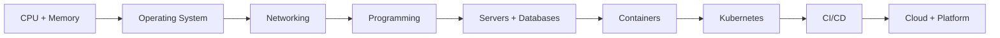
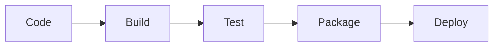

# DevOps From Scratch — Learning Roadmap

A structured path that starts from how computers work (CPU, memory, storage) and builds toward DevOps, platform engineering, and cloud tooling. This README is a **skeleton** for the future reorganization of the repository and for the GitHub Pages site.

## 🧭 Start Here
- [Roadmap (visual sketch + ordered path)](./roadmap.md)
- [Navigation page (jump to any topic/file)](./index.md)

## ✅ Goals
- Teach DevOps from the ground up: hardware → OS → networking → programming → systems → cloud → platform tools.
- Provide a clear learning path with **short lessons**, **labs**, and **diagrams**.
- Keep everything GitHub Pages–friendly (Markdown-first).

---

## 📌 Proposed Repository Structure (Skeleton)

```
/ (repo root)
├── README.md               # High-level roadmap and repo map (this file)
├── index.md                # GitHub Pages landing page
├── 00-foundations/         # CPU, memory, storage, boot process, OS basics
├── 01-networking/          # TCP/IP, DNS, HTTP, TLS, subnetting
├── 02-linux/               # Shell, filesystem, processes, systemd
├── 03-programming/         # Python + scripting for ops
├── 04-git/                 # Git basics, workflows, CI integration
├── 05-databases/           # SQL, NoSQL, backups, replication
├── 06-servers/             # Web servers, reverse proxies, load balancing
├── 07-containers/          # Docker, container lifecycle
├── 08-orchestration/       # Kubernetes, Helm, service mesh
├── 09-ci-cd/               # Pipelines, artifacts, testing
├── 10-observability/       # Logs, metrics, tracing
├── 11-infra-as-code/        # Terraform, Ansible, config mgmt
├── 12-cloud/               # AWS/GCP/Azure fundamentals
├── 13-platform-engineering/# Internal platforms, golden paths
├── 14-security/            # IAM, secrets, DevSecOps
├── 15-projects/            # Capstone projects and labs
└── assets/                 # Diagrams, images, shared assets
```

> Note: this is the **target structure**. Existing folders will be migrated into these sections in future steps.

---

## 🧭 Learning Path (Skeleton)

### Phase 1 — Computer & OS Fundamentals
- CPU architecture, memory, storage, boot process
- OS basics: kernel vs user space, processes, filesystems
- Basic Linux commands and shell

### Phase 2 — Networking & Web
- TCP/IP, DNS, HTTP/HTTPS
- Subnets, routing, NAT
- TLS basics and certificates

### Phase 3 — Programming for Ops
- Python scripting
- Automation, CLI tools, APIs

### Phase 4 — Systems & Data
- Databases (SQL/NoSQL)
- Servers (Nginx/Apache), reverse proxies
- Caching and queues

### Phase 5 — Containers & Orchestration
- Docker fundamentals
- Kubernetes, Helm, service discovery

### Phase 6 — CI/CD & Infrastructure
- Pipelines, testing, artifacts
- Terraform, Ansible, configuration management

### Phase 7 — Cloud & Platform
- Cloud core services
- Observability and SRE
- Platform engineering practices

---

## 🧩 Diagram Plan (Placeholders)

We will add visual diagrams as Mermaid (works in GitHub) and images in `/assets/`.

### Example: DevOps Journey



### Example: CI/CD Skeleton



---

## 📄 GitHub Pages Plan
- `index.md` will be the homepage (short intro + navigation).
- Each section folder will have its own `README.md` as the landing page.
- `assets/` will store reusable diagrams.

---

## 🔜 Next Steps
1. Map existing folders to the target structure.
2. Create section landing pages.
3. Migrate current notes into structured lessons.
4. Expand diagrams and add labs.

If you want, I can start migrating existing content into this structure next.
