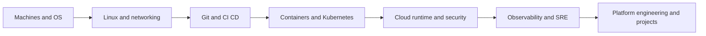

---
title: 'DevOps From Scratch'
---

# DevOps From Scratch

This site is a guided journey from machines to modern platforms. The goal is to help DevOps, Cloud, and SRE engineers understand not only what a tool does, but why it exists, where it breaks, and how it fits into the full operating model.

## What This Site Optimizes For

  

    
MAP

    <h3>One connected story</h3>
    
Foundations, delivery, runtime, cloud, reliability, and platform engineering are taught as one sequence instead of disconnected notes.

  

  

    
WHY

    <h3>DevOps-first framing</h3>
    
Each topic is tied back to delivery speed, safe change, runtime behavior, and operational tradeoffs.

  

  

    
RUN

    <h3>Cloud and SRE relevance</h3>
    
The site keeps connecting low-level concepts to cloud design, incident response, observability, and platform decisions.

  

## Platform Story

```mermaid
flowchart LR
  A[Machines and OS] --> B[Linux and networking]
  B --> C[Git and CI CD]
  C --> D[Containers and Kubernetes]
  D --> E[Cloud runtime and security]
  E --> F[Observability and SRE]
  F --> G[Platform engineering and projects]
```

Read the repository from left to right when you want a full-stack mental model. Jump into projects first when you want practical stories, then come back to the layers underneath.

## Why It Matters by Role

  

    
DV

    <h3>For DevOps engineers</h3>
    
This site helps connect build, test, release, runtime, and rollback work into one delivery system instead of a set of separate tools.

  

  

    
CL

    <h3>For cloud engineers</h3>
    
This site helps connect managed services, networking, identity, runtime choices, and platform tradeoffs back to the system behaviors underneath.

  

  

    
SR

    <h3>For SREs</h3>
    
This site helps connect change risk, latency, bottlenecks, incident response, and observability to the layers that actually create them.

  

## Best Entry Points

  

    
01

    <h3>Interactive Journey Map</h3>
    
Use the visual atlas when you want the whole platform story in one screen.

    
<a href="./index.html">Open page</a>

  

  

    
02

    <h3>Navigation Hub</h3>
    
Use the structured path when you want a cleaner reading route through the repository.

    
<a href="./navigation.html">Open page</a>

  

  

    
03

    <h3>From Computers to Cloud</h3>
    
Start here when cloud feels abstract and you want the lower-layer story first.

    
<a href="./00-foundations/from-computers-to-cloud.html">Open page</a>

  

  

    
04

    <h3>VM to AKS Modernization Story</h3>
    
Start here when you prefer realistic project narratives over isolated concept notes.

    
<a href="./15-projects/vm-to-aks-modernization-story.html">Open page</a>

  

  How to use this site
  <h3>Pick a path, not a random page</h3>
  
If you are building foundations, start with the story pages and section landing pages. If you are solving a real problem at work, jump to the closest section, then use the new previous and next navigation to move backward into fundamentals and forward into runtime, cloud, or SRE impact.

