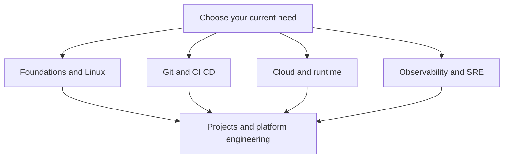

---
title: 'DevOps From Scratch Navigation Hub'
---

# DevOps From Scratch Navigation Hub

This page is the text-first reading guide for the repository. Use it when you want a clear study path by role, by layer, or by practical goal without depending only on the visual atlas.

## What This Page Helps You Do

  

    
PATH

    <h3>Choose a starting point</h3>
    
Pick foundations, delivery, runtime, cloud, observability, or projects based on what you need right now.

  

  

    
FLOW

    <h3>Move in a logical order</h3>
    
The hub helps you avoid jumping into advanced tools before the lower-layer ideas are stable.

  

  

    
LENS

    <h3>Study by role</h3>
    
You can use the hub as a DevOps path, a Cloud path, or an SRE path instead of reading everything at once.

  

## Reading Modes

If you are unsure where to begin, start with foundations or projects. Foundations give you the model. Projects show you how the model becomes real delivery and runtime work.

## Role-Focused Entry Paths

  

    
DV

    <h3>DevOps path</h3>
    
Read Foundations, Git, CI CD, Containers, Orchestration, and Security when your focus is safe and fast software delivery.

  

  

    
CL

    <h3>Cloud path</h3>
    
Read Foundations, Networking, Linux, Cloud, Infra as Code, and Platform Engineering when your focus is architecture and runtime design.

  

  

    
SR

    <h3>SRE path</h3>
    
Read Foundations, Linux, Orchestration, Observability, Security, and Projects when your focus is reliability, incidents, and service behavior.

  

## Best Starting Pages

  

    
01

    <h3>Foundations</h3>
    
Start here when you want the machine, operating-system, and storage model first.

    
<a href="./00-foundations/README.html">Open page</a>

  

  

    
02

    <h3>Cloud</h3>
    
Start here when you want runtime targets, edge flow, and well-architected tradeoffs.

    
<a href="./12-cloud/README.html">Open page</a>

  

  

    
03

    <h3>Observability</h3>
    
Start here when your focus is incidents, alerts, telemetry, and reliability loops.

    
<a href="./10-observability/README.html">Open page</a>

  

  

    
04

    <h3>Projects</h3>
    
Start here when you want realistic modernization and platform stories first.

    
<a href="./15-projects/README.html">Open page</a>

  

  How to use this hub
  <h3>Read with a concrete goal</h3>
  
Choose the path that matches your current problem or interview target. That keeps the repository readable and prevents the content from feeling like one giant undifferentiated note dump.

