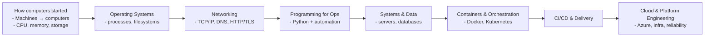

# DevOps From Scratch — Roadmap

This page gives you a **big-picture sketch** of the journey (from how computers started to modern platform engineering) and a **single ordered path** through the existing topics.

## 1) Big-Picture Sketch (Learning Journey)

## 2) Ordered Path (Current Topics, No Reordering)

Follow the topics below in the exact order they exist today. This preserves your current structure while giving a clean navigation path.

1. [Basics](./Basics/)
2. [CS](./CS/)
3. [basics](./basics/)
4. [On-Prem Story & Migration](./todo/01-onprem-story.todo.md)
5. [Monolith → Microservices](./todo/03-monolith-to-microservices.todo.md)
6. [Containers & Docker](./todo/04-containers-docker.todo.md)
7. [Kubernetes](./K8s/)
8. [Programming & Scripting](./Python/)
9. [Git & Version Control](./todo/05-version-control-before-git.todo.md)
10. [Databases](./DB/)
11. [Server](./Server/)
12. [cloud-networking](./cloud-networking/)
13. [Notes & Backlog](./progress%20md)

## 3) How to Use This Roadmap

- **Start with the ordered path** above and go top-to-bottom.
- Use the **Topic Navigation** section on the homepage to jump directly to any file.
- Capture new learnings in the **Notes & Backlog** file, then later migrate them into the proper folder when you refine structure.

## 4) Recommended Missing Topics (TODO)

Add these as you expand the repo. They are grouped from fundamentals to advanced topics and tools that are common in DevOps/platform roles.

### 4.1) Foundations (TODO)
- Computer history (from early machines to modern CPUs)
- Number systems, binary/hex, data encoding
- CPU architecture, memory hierarchy, storage basics
- Boot process (BIOS/UEFI), firmware, and kernel initialization
- OS concepts: processes, threads, scheduling, syscalls
- Filesystems internals, permissions, and storage layers

### 4.2) Networking (TODO)
- OSI model & TCP/IP deep dive
- L2/L3: ARP, VLANs, routing, BGP basics
- L4/L7: load balancing, reverse proxies
- DNS, DHCP, NAT, MTU, and troubleshooting
- TLS/SSL, certificates, and mTLS

### 4.3) Application Layers & Failures (TODO)
- App architecture basics (monoliths vs services)
- Application layers (UI, API, service, data)
- Failure modes: timeouts, retries, thundering herd
- Performance tuning: caching, queues, backpressure
- Incident response patterns and postmortems

### 4.4) Linux & Systems (TODO)
- Systemd, logging, journal, and process management
- Resource isolation (cgroups, namespaces)
- Kernel tuning and performance tools
- Storage troubleshooting (IOPS, latency, RAID)

### 4.5) Databases & Data Systems (TODO)
- SQL vs NoSQL tradeoffs
- Replication, backups, PITR, HA strategies
- Data consistency, transactions, locks, indexes
- Managed vs self-hosted databases

### 4.6) Containers & Orchestration (TODO)
- Container lifecycle, images, registries
- Kubernetes workloads, networking, storage
- Service meshes, gateways, and ingress patterns
- Scaling: HPA, VPA, cluster autoscaling

### 4.7) CI/CD & Release Engineering (TODO)
- Pipeline design, environments, and approvals
- Build artifacts, SBOMs, and provenance
- GitOps workflows and promotion strategies

### 4.8) Infrastructure as Code (TODO)
- Terraform state and module design
- Policy as code (OPA, Azure Policy)
- Configuration management (Ansible, Chef)

### 4.9) Cloud & Platform (TODO)
- Azure core services (compute, storage, network)
- IAM, RBAC, and identity federation
- Landing zones, hub/spoke networking
- Cost management and FinOps

### 4.10) Observability & SRE (TODO)
- Logs, metrics, traces (golden signals)
- SLIs/SLOs, error budgets
- Alerting design and noise reduction

### 4.11) Security & Compliance (TODO)
- Secrets management (Vault, Key Vault)
- Container/image security (scanning, signing)
- Threat modeling and secure defaults
- Compliance basics (SOC2, ISO, PCI)

### 4.12) Tools to Cover (TODO)
- GitHub Actions / Azure DevOps / GitLab CI
- Docker, Helm, Kustomize
- Terraform, Ansible, Packer
- Prometheus, Grafana, Loki, OpenTelemetry
- Argo CD / Flux, Backstage
