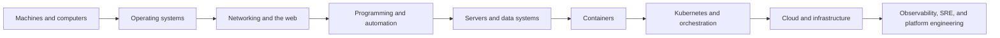
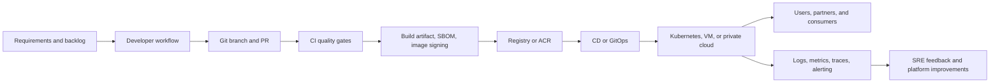

# Roadmap

This roadmap explains both journeys we care about:
1. the evolution from computer fundamentals to cloud platforms
2. the software delivery path from requirements to production operations

## 1. Foundations to Platform Journey

```mermaid
flowchart LR
    A[Machines and computers] --> B[Operating systems]
    B --> C[Networking and the web]
    C --> D[Programming and automation]
    D --> E[Servers and data systems]
    E --> F[Containers]
    F --> G[Kubernetes and orchestration]
    G --> H[Cloud and infrastructure]
    H --> I[Observability, SRE, and platform engineering]
```

## 2. Software Delivery Journey

```mermaid
flowchart LR
    A[Requirements and backlog] --> B[Developer workflow]
    B --> C[Git branch and PR]
    C --> D[CI quality gates]
    D --> E[Build artifact, SBOM, image signing]
    E --> F[Registry or ACR]
    F --> G[CD or GitOps]
    G --> H[Kubernetes, VM, or private cloud]
    H --> I[Users, partners, and consumers]
    H --> J[Logs, metrics, traces, alerting]
    J --> K[SRE feedback and platform improvements]
```

## 3. Focus Areas for the Next Content Wave

### Delivery and DevSecOps
- Branching and PR hygiene
- CI stages and promotion gates
- SAST, secret scanning, dependency scanning, IaC scanning
- SBOM generation, provenance, image signing, registry policy

### Runtime and Cloud
- DNS, CDN, Front Door, WAF, ALB, API gateway, ingress, and NGINX
- Kubernetes versus VM deployment models
- Private cloud and hybrid cloud runtime patterns
- Data, cache, queue, storage, and service-to-service traffic
- Well-architected review and system design tradeoffs

### Reliability and Platform Engineering
- Monitoring, logging, tracing, alerting, incident response
- SLIs, SLOs, and error budgets
- Terraform, policy as code, landing zones, and access control
- Internal developer platforms, templates, golden paths, and guardrails

## 4. What Changes First

1. New section landing pages
2. New high-level diagram pages
3. Real story pages for VM to AKS, cloud architecture, and role progression
4. Migration map from old folders to new structure
5. Incremental movement of existing markdown into the new sections
